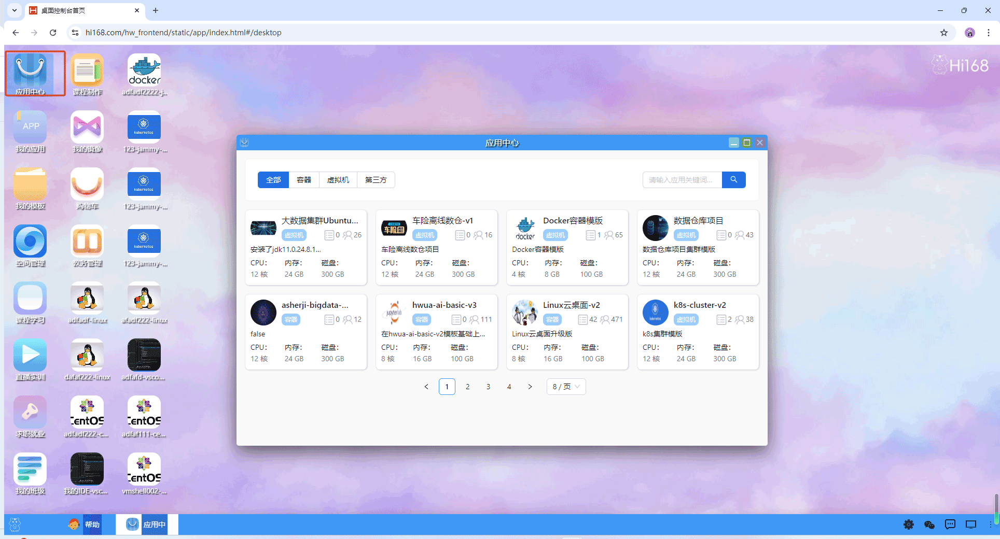
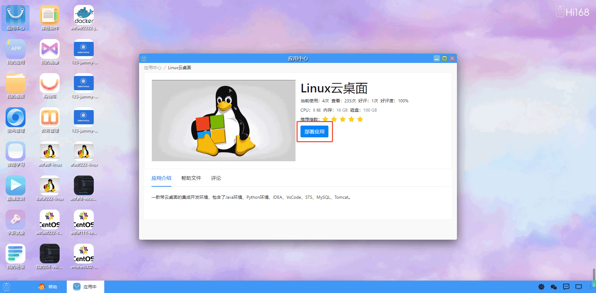
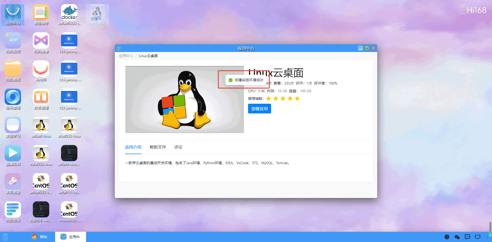
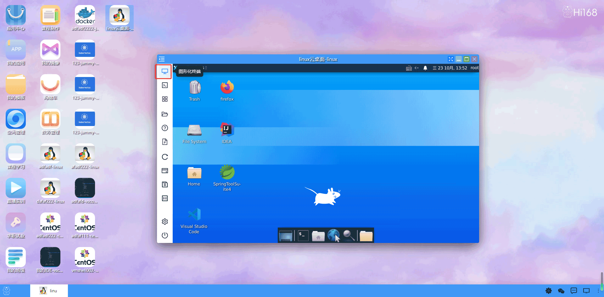
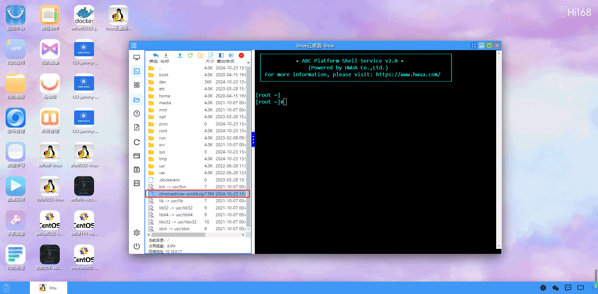

## 应用中心
#### 概述
hi168平台的“应用中心”包含了用于部署各种实验环境的“应用”。应用用于定义部署一个实验环境的完整过程。 当我们选择使用一个应用后，就可以使用这个应用来一键搭建我们的实验环境。

为了使用应用，需要先进入hi168平台的“应用中心”页面。如下图所示。

在“全部应用”右侧的搜索框中，可以搜索自己感兴趣的应用。 比如，如果我们希望部署Linux的实验环
境，就可以搜索“Linux”这个关键字。

点击应用图片，会进入到该应用的详情界面。如下图所示。

点击确认，就会进入应用的部署页面。如下图所示。
然后点击“使用应用”按钮，就会将该应用添加到自己的应用清单里。如下图所示。

进入部署页面后，需要给你的应用部署取一个名称，比如上例中的“Linux云桌面”。 其他参数不用修改，使用默认值即可。 然后点击确认，就可以部署一个新的Linux实验环境了。如下图所示。

接下来双击实验环境的图标，就可以进入到应用部署的实验环境了。如下图所示。

hi168平台的实验环境支持Shell、图形化桌面、HTTP/TCP/UDP端口共三类访问应用环境的方式。 具体如下。

1.Shell访问

2.图形化桌面访问

3.HTTP/TCP/UDP端口访问

通过以上三类访问环境服务的方法，我们能够非常方便地与应用部署的实验环境进行交互了。

我们还可以通过左侧的“环境文件”功能往应用环境里上传或者下载文件。 通过点击应用环境左侧的“环境文件”图标，可以展开或关闭“环境文件”功能。如下图所示。

通过左右拖动蓝线，可以调整“环境文件”的显示宽度。

在“环境文件”靠上方的部分是功能按钮。 从左到右依次是上级目录、下载、上传、刷新、新建目录、新建文件、隐藏文件、复制文件路径、删除文件的功能。

以上传为例子，点击“环境文件”的“上传”按钮，就可以进行文件上传。具体如下：

上传过程中，会显示上传进度。如下图所示。

上传完成后，就可以看到上传的文件了。如下图所示。

