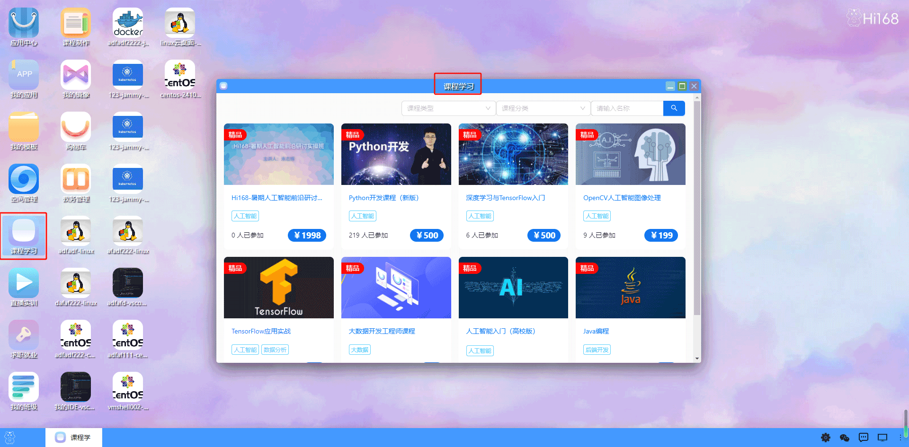

## 课程学习
#### 概述
HI168平台现有课程60+门，涉及人工智能、数据库、云计算与大数据、区块链等多个热门分类。按课程难
度分为入门、初级、中级、高级四类，另有框架和案例两个单独类型。
课程按章节划分，每一节下有视频课程、案例实验、练习刷题、课件、讨论五大板块，帮助学生巩固学习成果。

用户双击打开课程学习后，首先展示一个课程列表界面，列出所有的课程，每个课程会显示名称，课程类型，参与人数，价格等。

用户点击任意一个课程后，会进入该课程的详细信息页面，可以查看到该课程的点赞收藏数量，加入状态，课程的介绍，课程目录以及附件评论等内容。

在课程详细信息页面上，用户可以进行点赞，收藏/取消收藏操作，加入/退出课程，查看评论，查看课程目录，点击课程进行观看。

