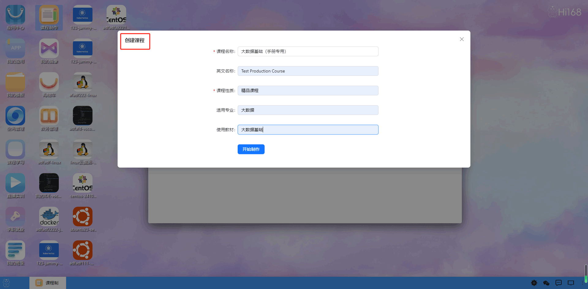
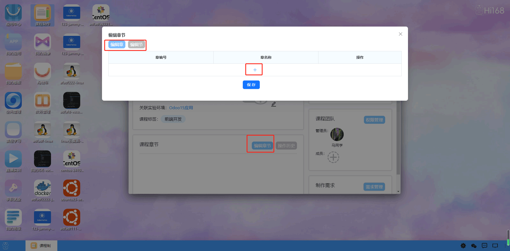
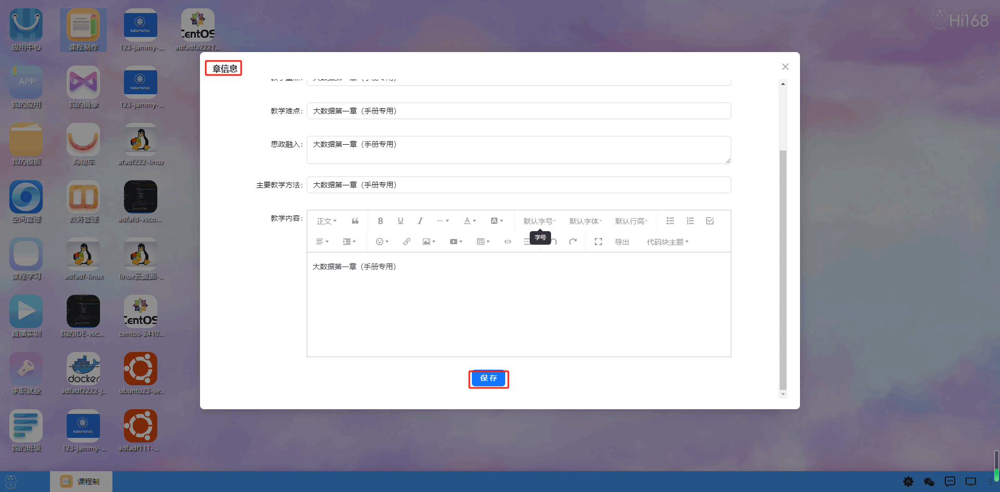
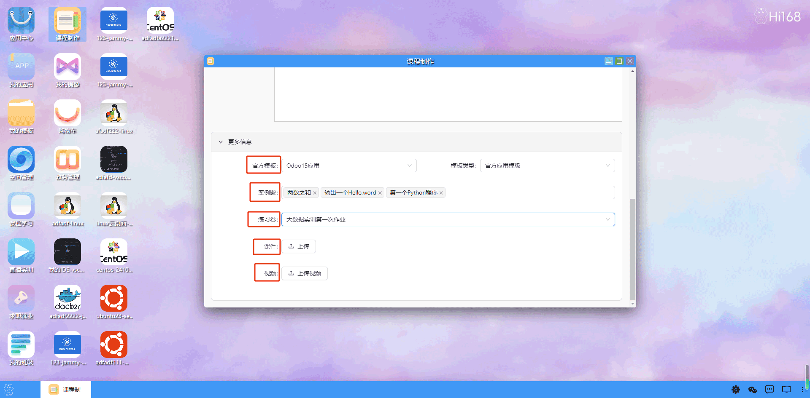

## 课程制作
hi168桌面平台旨在为教育工作者和学习者提供一个高效、灵活的课程管理和学习环境。通过本平台，您可以轻松创建、管理和分享高质量的课程内容，主要包括课程制作（可以绑定对应的教学视频，实验环境，案例，练习题 ，课件等）。

主页提供了一个清晰的课程分类导航栏，用户可以通过点击不同的分类快速浏览和搜索感兴趣的课程。   
搜索功能允许用户通过关键词快速查找特定的课程.

 新建课程:用户可以创建新的课程，并填写课程的基本信息。

 课程详情页面:展示课程的基本信息并完善其他需要的课程信息，包括课程名称、简介、分类、模板，应用模板，专业等。

每个课程可以分为多个章节，每个章可以包含多种类型的内容,每个节里面可以绑定所需要的教学视频，实验环境，案例，练习题 ，课件等。
添加章：进入课程详情页面,在章节列表中选择一个章，点击创建进入章详情页面。

添加章：进入章页面,在章列表中选择创建一个或多个节，点击创建进入节详情页面。

每个节里面可以绑定所需要的教学视频，实验环境，案例，练习题 ，课件等。

实验手册：每个课程可以绑定一个实验手册，手册可以保存并查看历史记录。

