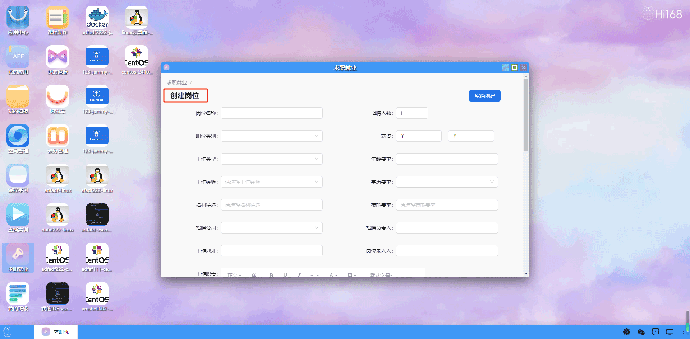

## 求职就业

#### 概述
求职就业模块是为毕业生和求职者提供 职位信息和招聘服务的功能模块。该模块结合人工智能技术和大数据分析，能够提供更加智能、个性化的求职服务。 同时，该模块也为企业提供更加高效的人才招聘服务。

用户双击打开求职就业后，首先展示一个职位列表界面，列出所有的职位岗位。在上方提供筛选选项，让用户可以选择查看全部职位、招聘中的职位、待开放的职位或已关闭的职位。

在右上方提供一个“发布职位”按钮，用户点击后可以设置岗位相关信息（岗位名称，招聘状态，工作地点，薪资范围等），并最终发布职位，用户填写完岗位相关信息后，点击“创建”或“发布”按钮，即可将该岗位发布到平台上供求职者查看。

#### 其他操作：
用户可以在职位详情页面查看特定岗位的详细信息，包括薪资、要求等。  
提供申请按钮，让求职者可以直接申请该岗位。  
用户也可以编辑已发布的岗位信息或关闭某个岗位招聘。  