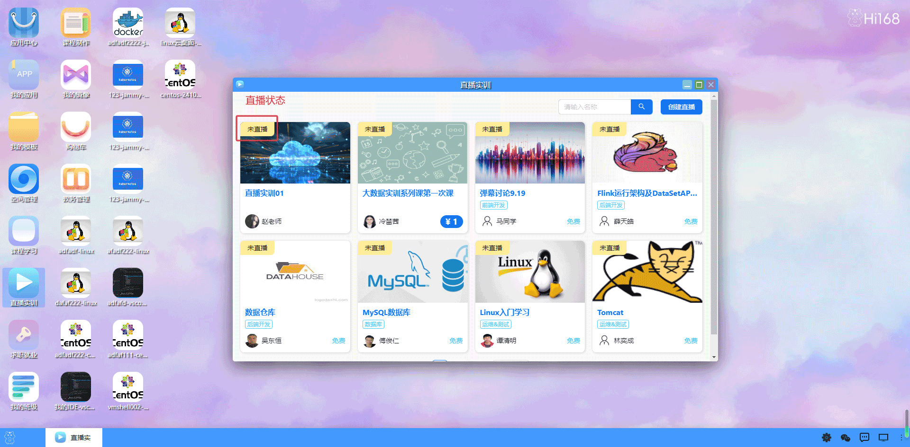
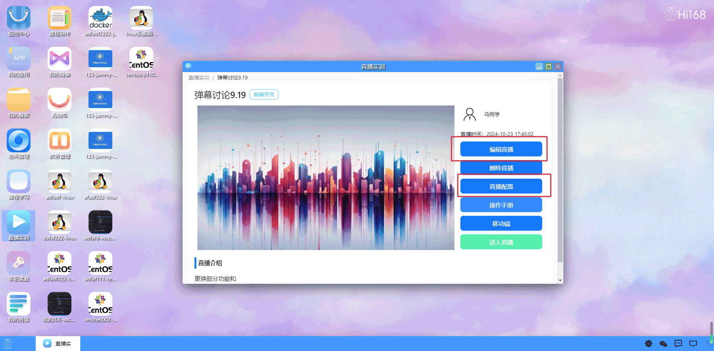
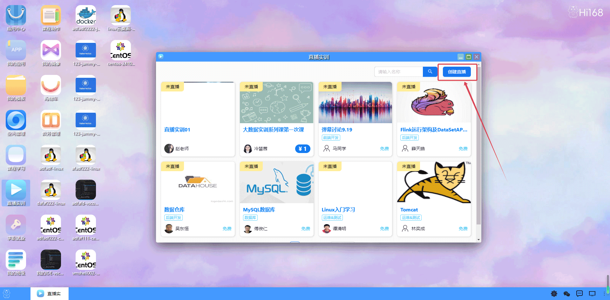
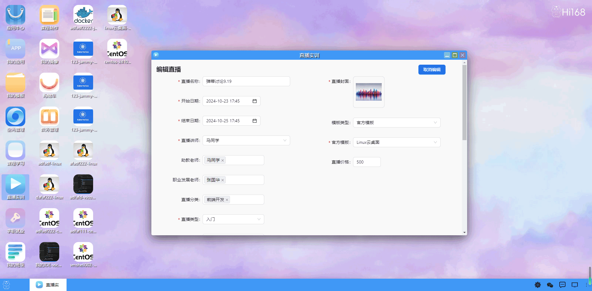

## 直播实训
#### 概述
hi168平台的直播实训模块是为了帮助教育工作者更好地进行在线教学而开发的一项功能。
该模块支持实时在线直播。以下是该模块的主要特点：
高可靠性：支持多种设备接入，保证学生访问的稳定性和可靠性。
多种交互方式：支持语音、文字、图片、文件交互，在直播中学生和老师可以相互沟通。
灵活性：多种设置实现班级直播、组别直播等多种形式和方式，支持多个用户同时观看一场直播。
该模块的使用可以为老师提供更加丰富的教育教学手段，同时也可以为学生提供更加便捷、高效的在线学习体验。

用户双击打开直播实训后，首先展示一个直播列表界面，列出所有即将进行或正在进行的直播。

每个直播应包含名称，类型，时间，直播讲师，直播状态等基本信息。

用户可以通过右上角提供一个“创建直播”按钮，用户点击后可以创建并设置直播相关信息。

#### 功能介绍
**创建直播：**在右上角提供一个“创建直播”按钮，用户点击后可以填写直播相关信息，包括名称，类型，时间，直播讲师，直播状态等。   
**编辑直播：**用户可以编辑直播相关信息包括名称，类型，时间，直播讲师，直播状态等。  
**删除直播：**用户点击“删除直播”按钮后，系统应提示用户确认是否删除该直播，确认后将该直播从直播列表中移除。   
**直播配置：**提供直播的配置信息，如推流地址、OBS服务器，OBS串流密钥等内容便于用户推流直播。  
 
**移动端：**展示微信小程序二维码。   
**操作手册：**介绍HI168直播推流到OBS服务器的详细流程。   

