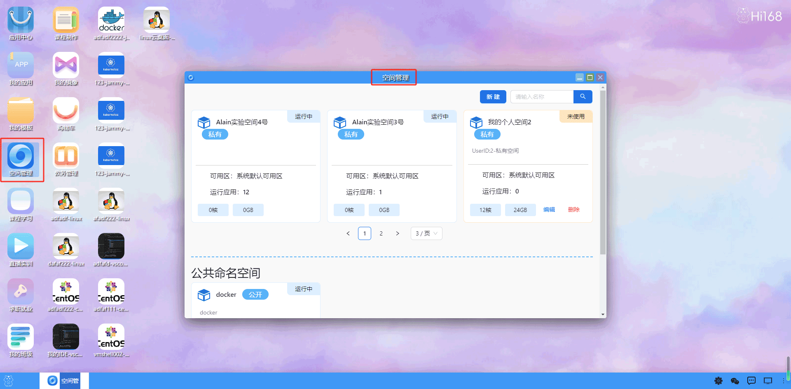

## 空间管理
#### 概述
命名空间板块允许用户在实验环境中创建多个公用或者私用的命名空间，每个命名空间可以包含特定实验或项目所需的数据和其他资源。这样可以确保不同实验之间的资源相互隔离，避免冲突。“我的个人空间” 属于私有空间，用户拥有独立控制权，还能了解已创建应用数量以及具备的硬件资源，而 “公共命名空间” 可供多人访问和使用。

用户双击打开空间管理后，首先展示一个命名空间列表界面，列出所有的私用命名空间和公共命名空间。每个命名空间都应包含名称，状态（私有或者公用），配置（CPU核数、内存容量等）等信息。
在列表中区分私用命名空间和公共命名空间，以方便用户快速识别。通过 “新建” 按钮，用户可创建新的空间，以满足不同的资源存储和应用部署需求 。

