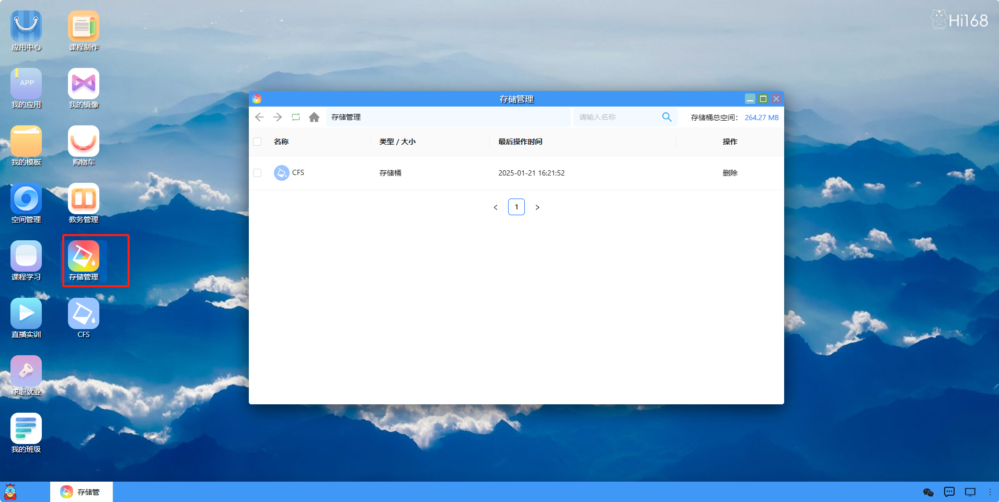

## 存储管理

#### 概述

存储管理中的 “存储桶（Bucket）” 是一种在云计算和数据存储环境中用于存储和组织数据对象的逻辑容器。
存储管理是指对存储桶进行创建、配置、操作、维护和监控等一系列活动的总称，在确保数据在存储桶中能够安全、高效、有序地存储和访问，以满足用户或组织在数据存储和处理方面的各种需求。

双击打开存储管理之后，首先展示一个存储管理列表界面，列出用户创建的所有存储桶，也可以右键新建一个存储桶，
用户可以点击列表中的任何一个存储桶，进入该存储桶的详细概览页面。

点击进入存储桶之后，展示该存储桶里文件的名称，类型大小等信息，可以进行上传文件，下载文件，删除文件，新建文件夹等一系列操作，鼠标右键文件有预览，复制，移动等功能，也可以让用户对存储管理有一个整体的了解。

**在线预览**：无需下载文件到本地，直接在当前界面查看文件内容，方便快速浏览文件信息，支持图片、视频等多种格式。  
**复制**：创建所选文件的副本，可将副本粘贴到存储管理内的其他位置，或其他存储区域。  
**移动**：把文件从当前位置转移到其他指定位置，原位置不再保留该文件。  
**重命名**：更改文件的名称，便于更好地识别和管理文件。  
**分享文件**：生成分享链接或通过特定方式将文件共享给他人，方便协作或传递资料。  
**下载**：将存储管理中的文件保存到本地设备，以便在本地进行查看、编辑等操作。  
**删除**：从存储管理中移除所选文件，或直接彻底删除。  

对于正在上传中的文件或者正在下载的文件，可以点击下方的任务栏查看文件的上传进度和下载进度。

上传多个文件时，可以进行全部开始任务，暂停全部任务，清空已完成任务，删除全部任务等一系列操作。

