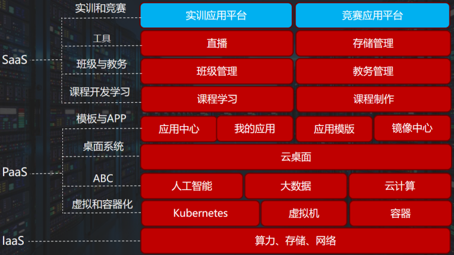

# 深算工场-docs

#### 深算工场介绍

一个海文自建的云计算平台,提供桌面版功能，将开发、交付、云应用等板块以APP的形式嵌入桌面版页面。深算工场是基于轻量级容器和虚拟机技术混合架构模式的开放式云平台，支持多种AI和大数据框架，支持以插件的方式加入平台，开箱即用，支持Nvidia全系GPU，支持GPU拆分共享教学，多云无限扩容，可以跟高校扩容多个节点，实现基础设施资源的智能化调度。

深算工场2B端，主要应用在高校的大数据、人工智能、云计算、区块链、开发方向的相关专业和课程，可以采用私有云部署和公有云服务两种方式，平台同时也提供认证、实训、竞赛等方面的服务。 深算工场2C端，主要针对社会上的计算机相关使用人员，包括：大数据、人工智能、云计算、网络运维等方面，提供云数据库、云操作系统、容器和虚拟机、各种APP应用的PaaS和SaaS服务。

* [新手快速入门](./manual/hi168_GettingStarted.md)
    * [1、案例一：部署eNSP应用](./manual/beginner/first_app.md)
    * [2、案例二：部署Ubuntu应用并安装Web服务](./manual/beginner/second_app.md)
    * [3、案例三：安装Ubuntu24.04操作系统](./manual/beginner/make_mirrorimage.md)
* [一、应用中心](./manual/hi168_AppCentor.md)
    * [1、应用列表](./manual/01/app_list.md)
    * [2、应用部署](./manual/01/app_deploy.md)
    * [3、应用界面](./manual/01/app_interface.md)
* [二、我的应用](./manual/hi168_MyApp.md)
    * [1、应用列表](./manual/02/app_list.md)
    * [2、应用详情](./manual/02/app_details.md)
    * [3、创建快照](./manual/02/create_snapshot.md)
    * [4、创建模板](./manual/02/create_template.md)
    * [5、删除应用](./manual/02/delete_app.md)
    * [6、添加应用](./manual/02/add_app.md)
* [三、应用模板](./manual/hi168_MyTemplate.md)
    * [1、模板列表](./manual/03/template_list.md)
    * [2、编辑模版](./manual/03/edit_template.md)
    * [3、发布模板](./manual/03/publish_template.md)
    * [4、部署模板](./manual/03/deploy_template.md)
    * [5、分享模板](./manual/03/share_template.md)
* [四、空间管理](./manual/hi168_SpaceManagement.md)
    * [1、个人空间](./manual/04/personal_space.md)
    * [2、新建空间](./manual/04/create_space.md)
* [五、云端互联](./manual/hi168_CloudInterconnection.md)
    * [1、单客户端](./manual/05/single_client.md)
    * [2、多客户端](./manual/05/multi_client.md)
* [六、存储管理](./manual/hi168_StorageBucket.md)
    * [1、存储桶列表](./manual/06/storage_bucket_list.md)
    * [2、新建存储桶](./manual/06/create_storage_bucket.md)
    * [3、删除存储桶](./manual/06/delete_storage_bucket.md)
    * [4、存储桶内容操作](./manual/06/storage_bucket_operate.md)
    * [5、分享文件](./manual/06/share.md)
* [七、镜像中心](./manual/hi168_MirrorCenter.md)
    * [1、镜像列表](./manual/07/mirror_list.md)
    * [2、新建镜像](./manual/07/create_mirror.md)
    * [3、镜像操作](./manual/07/mirror_operate.md)
    * [4、制作应用模板](./manual/07/create_template.md)
* [八、培训认证](./manual/hi168_TrainingCertification.md)
    * [1、课程学习](./manual/08/hi168_CourseLearning.md)
        * [1-1 课程列表](./manual/08/course_learning/course_list.md)
        * [1-2 课程详情](./manual/08/course_learning/course_details.md)
        * [1-3 课程播放](./manual/08/course_learning/course_play.md)
        * [1-4 课程加入](./manual/08/course_learning/course_join.md)
    * [2、课程制作](./manual/08/hi168_CourseMake.md)
        * [2-1 课程列表](./manual/08/course_make/course_list.md)
        * [2-2 课程详情](./manual/08/course_make/course_details.md)
        * [2-3 新建课程](./manual/08/course_make/create_course.md)
        * [2-4 编辑课程](./manual/08/course_make/edit_course.md)
        * [2-5 发布课程](./manual/08/course_make/publish_course.md)
    * [3、教务管理](./manual/08/hi168_EduAdmin.md)
        * [3-1 班级列表](./manual/08/edu_admin/class_list.md)
        * [3-2 学生列表](./manual/08/edu_admin/student_list.md)
        * [3-3 创建班级](./manual/08/edu_admin/create_class.md)
        * [3-4 查看/编辑班级](./manual/08/edu_admin/find_edit_class.md)
        * [3-5 查看/编辑学生](./manual/08/edu_admin/find_edit_student.md)
    * [4、我的班级](./manual/08/hi168_MyClass.md)
        * [4-1 班级列表](./manual/08/my_class/class_list.md)
        * [4-2 班级详情](./manual/08/my_class/class_details.md)
    * [5、求职就业](./manual/08/hi168_Job.md)
        * [5-1 岗位列表](./manual/08/job/job_list.md)
        * [5-2 发布岗位](./manual/08/job/publish_job.md)
* [九、直播](./manual/hi168_Live.md)
    * [1、直播列表](./manual/09/live_list.md)
    * [2、创建直播](./manual/09/create_live.md)
    * [3、编辑直播](./manual/09/edit_live.md)
    * [4、删除直播](./manual/09/delete_live.md)
    * [5、直播配置](./manual/09/live_config.md)
    * [6、操作手册](./manual/09/operating_manual.md)
    * [7、移动端](./manual/09/live_mobile.md)
* [十、论坛](./manual/hi168_Forum.md)
    * [1、论坛板块](./manual/10/forum_section.md)
    * [2、板块详情](./manual/10/section_details.md)
    * [3、发帖子](./manual/10/post.md)
* [十一、实训管理](./manual/hi168_TrainingManagement.md)
    * [1、教师端](./manual/11/teacher.md)
    * [2、学生端](./manual/11/student.md)
* [十二、桌面中心](./manual/hi168_DesktopCenter.md)
    * [1、个人信息](./manual/12/personal_information.md)
    * [2、费用中心](./manual/12/cost_center.md)
    * [3、讨论](./manual/12/discuss.md)
    * [4、帮助](./manual/12/help.md)
    * [5、设置](./manual/12/set.md)
* [十三、费用规则](./manual/hi168_BillingRules.md)
* [十四、下载中心](./manual/hi168_DownloadCenter.md)
* [十五、客户信息安全管理](./manual/hi168_InformationSafety.md)

#### 深算工场后台配置
* [一、算力点管理及算力模板配置](./admin-manual/computing.md)
    * [1、算力模板](admin-manual/computing-power/compute-template.md)
    * [2、模板选项](admin-manual/computing-power/template-options.md)
    * [3、算力配置记录](admin-manual/computing-power/compute-configuration-record.md)
    * [4、用户算力点](admin-manual/computing-power/user-compute-points.md)
    * [5、算力消耗](admin-manual/computing-power/compute-consumption.md)
    * [6、变动明细](admin-manual/computing-power/change-detail.md)
    * [7、增加明细](admin-manual/computing-power/addition-detail.md)
* [二、s3存储管理](admin-manual/s3.md)
    * [1、oss服务账号管理](admin-manual/s3-storage/account-management.md)
    * [2、s3存储管理](admin-manual/s3-storage/s3-storage-management.md)
    * [3、存储桶](admin-manual/s3-storage/storage-bucket.md)
    * [4、文件分享](admin-manual/s3-storage/file-sharing.md)
    * [5、实验环境挂载OSS](admin-manual/s3-storage/container-mounting.md)
    * [6、存储空间调整](admin-manual/s3-storage/space-adjustment.md)
    * [7、挂载目录路径记录](admin-manual/s3-storage/mounted-directory-logs.md)
    * [8、任务记录](admin-manual/s3-storage/task-records.md)   
    * [9、云存储账号配置](admin-manual/s3-storage/cloud-storage.md)
    * [10、OSS存储系统配置](admin-manual/s3-storage/oss-storage.md)
    * [11、服务类型](admin-manual/s3-storage/service-type.md)
* [三、系统-可用区](admin-manual/system-availability-zone.md)
    * [1、可用区](admin-manual/system-zone/availability-zone.md)
    * [2、用户默认可用区](admin-manual/system-zone/default-availability-zone.md)
    * [3、gpu管理器](admin-manual/system-zone/gpu-manager.md)
    * [4、集群节点](admin-manual/system-zone/cluster-nodes.md)
    * [5、容器镜像节点](admin-manual/system-zone/container-image-nodes.md)
    * [6、gpu资源](admin-manual/system-zone/gpu-resources.md)
    * [7、环境保存](admin-manual/system-zone/save-environment.md)
    * [8、用户环境保存](admin-manual/system-zone/user-environment-save.md)
    * [9、集群标签](admin-manual/system-zone/cluster-tags.md)
    * [10、集群标签值](admin-manual/system-zone/cluster-tag-values.md)
    * [11、节点亲和性标签](admin-manual/system-zone/node-affinity-tags.md)
* [四、应用](admin-manual/app.md)
    * [1、应用部署](admin-manual/app/app_deploy.md)
    * [2、应用环境](admin-manual/app/app_environment.md)
    * [3、应用实施](admin-manual/app/app_implement.md)
    * [4、应用模板](<admin-manual/app/public _template.md>)
    * [5、用户应用模板](admin-manual/app/user_template.md)
    * [6、应用快照](admin-manual/app/app_snapshot.md)
    * [7、应用类别](admin-manual/app/app_category.md)
* [五、命名空间](admin-manual/namespace/namespace.md)
    * [1、命名空间](admin-manual/namespace/namespace.md)
* [六、存储](admin-manual/storage/type.md)
   * [1、存储类型](admin-manual/storage/type.md)
   * [2、存储快照类型](admin-manual/storage/snapshot.md)
   * [3、存储卷挂载](admin-manual/storage/volume-mount.md)
   * [4、存储管理器](admin-manual/storage/storage-manager.md)
   * [5、存储区域](admin-manual/storage/storage-area.md)
* [七、网络](admin-manual/network/ip-record.md)
   * [1、ip段](admin-manual/network/ip-segment.md)
   * [2、ip记录](admin-manual/network/ip-record.md) 
   * [3、LB服务IP地址池](admin-manual/network/lb-address.md)
   * [4、LB服务端口号](admin-manual/network/lb-service.md)
   * [5、LB服务共享Key](admin-manual/network/lb-shared-key.md)
   * [6、云端互联服务器](admin-manual/network/cloud-interconnect.md)
   * [7、云端互联客户端](admin-manual/network/client.md)
   * [8、云端互联账号](admin-manual/network/ros-account.md)
* [八、服务器管理](admin-manual/server-management/hardware-value.md)
   * [1、硬件参数值](admin-manual/server-management/hardware-value.md)
   * [2、硬件参数](admin-manual/server-management/hardware-params.md)
   * [3、硬件](admin-manual/server-management/hardware.md)
* [九、镜像仓库](admin-manual/image-registry/repository.md)
   * [1、镜像仓库](admin-manual/image-registry/repository.md)
   * [2、镜像加速仓库](admin-manual/image-registry/image-acceleration.md)
   * [3、公共容器仓库](admin-manual/image-registry/public--image.md)
   * [4、公共虚拟机镜像](admin-manual/image-registry/public-vm-image.md)
   * [5、用户容器镜像](admin-manual/image-registry/user-image.md)
   * [6、用户虚拟机镜像](admin-manual/image-registry/user-vm-image.md)
   * [7、仓库类型](admin-manual/image-registry/repo-type.md)
   * [8、仓库地址](admin-manual/image-registry/repo-address.md)
   * [9、仓库版本](admin-manual/image-registry/repo-version.md)
* [十、资源角色](admin-manual/resource-role/user-role.md)
   * [1、用户促销](admin-manual/resource-role/user-role.md)
   * [2、用户使用资源](admin-manual/resource-role/user-resources.md)
   * [3、用户角色](admin-manual/resource-role/name.md)
   * [4、促销标签](admin-manual/resource-role/label.md)
   * [5、促销规则](admin-manual/resource-role/rule.md)
   * [6、角色资源限制](admin-manual/resource-role/restriction.md)
* [十一、课程](<admin-manual/course management/course.md>)
   * [1、课程管理](<admin-manual/course management/course.md>)
   * [2、课程历史记录](<admin-manual/course management/course-record.md>)
   * [3、视频库](<admin-manual/course management/course-library.md>)
   * [4、学员视频观看表](<admin-manual/course management/studen-table.md>)
   * [5、课程类型](<admin-manual/course management/course-type.md>)
   * [6、课程分类](<admin-manual/course management/course-category.md>)
   * [7、课程评论](<admin-manual/course management/course-comment.md>)
   * [8、培训评论](<admin-manual/course management/training-comment.md>)
   * [9、举手提问](<admin-manual/course management/raise-question.md>)
   * [10、课程用户学习状态统计](<admin-manual/course management/course-statistics.md>)
   * [11、直播签到](<admin-manual/course management/livesign-in.md>)
   * [12、需求管理](<admin-manual/course management/demand.md>)
   * [13、班级课程](<admin-manual/course management/class-courses.md>)
   * [14、直播统计](<admin-manual/course management/live-stream.md>)
   * [15、直播培训标签](<admin-manual/course management/live-sign.md>)
* [十二、实训管理](admin-manual/practical-training/practical-training.md)
   * [1、实训管理](admin-manual/practical-training/practical-training.md)
   * [2、实训学生管理](admin-manual/practical-training/student-management.md)
   * [3、实训资源管理](admin-manual/practical-training/resource-management.md)
   * [4、实训任务管理](admin-manual/practical-training/task-management.md)
   * [5、实训任务详情](admin-manual/practical-training/task-details.md)
* [十三、教务管理](admin-manual/academic-management/course-plan.md)
   * [1、开课计划](admin-manual/academic-management/course-plan.md)
   * [2、学期设置](admin-manual/academic-management/semester.md)
   * [3、周设置](admin-manual/academic-management/weekly-settings.md)
   * [4、课时设置](admin-manual/academic-management/period-settings.md)
   * [5、学年](admin-manual/academic-management/academic-year.md)
   * [6、人才方案制定](admin-manual/academic-management/talent-plan.md)
   * [7、课程设置](admin-manual/academic-management/course-settings.md)
   * [8、招生对象](admin-manual/academic-management/admission-targets.md)
   * [9、培养体系](admin-manual/academic-management/cultivation-system.md)
   * [10、选修课程上课计划](admin-manual/academic-management/elective-courses.md)
   * [11、专业](admin-manual/academic-management/major.md)
   * [12、专业大类](admin-manual/academic-management/major-category.md)
   * [13、专业小类](admin-manual/academic-management/major-subcategory.md)
   * [14、专业方向](admin-manual/academic-management/major-direction.md)
   * [15、课程设置](admin-manual/academic-management/course-settings.md)
   * [16、课程类别](admin-manual/academic-management/course-category.md)
   * [17、课程类型](admin-manual/academic-management/course-type.md)
   * [18、考核方式](admin-manual/academic-management/assessment-method.md)
   * [19、教室](admin-manual/academic-management/classroom.md)
   * [20、教研活动](admin-manual/academic-management/teaching-lectures.md)
   * [21、进修情况](admin-manual/academic-management/records.md)
   * [22、学术讲座](admin-manual/academic-management/academic-lectures.md)
   * [23、学术笔记](admin-manual/academic-management/academic-notes.md)
   * [24、文章发表](admin-manual/academic-management/article.md)
   * [25、科研成果](admin-manual/academic-management/research.md)
   * [26、科研成果明细](admin-manual/academic-management/research-details.md)
* [十四、AI模型与数据集](admin-manual/AI/model/personal-model.md)
   * [1、个人模型](admin-manual/AI/model/personal-model.md)
   * [2、公共模型](admin-manual/AI/model/public-model.md)
   * [3、个人数据集](admin-manual/AI/dataset/01-dataset.md)
   * [4、公共数据集](admin-manual/AI/dataset/02-dataset.md)
   * [5、模型-点赞](admin-manual/AI/model-others/like.md)
   * [6、模型-收藏](admin-manual/AI/model-others/favorite.md)
   * [7、模型-评论](admin-manual/AI/model-others/comment.md)
   * [8、数据集-收藏](admin-manual/AI/dataset-others/favorite.md)
   * [9、数据集-点赞](admin-manual/AI/dataset-others/like.md)
   * [10、数据集-评论](admin-manual/AI/dataset-others/comment.md)
   * [11、模型生成方式](admin-manual/AI/configuration/model-method.md)
   * [12、研究领域](admin-manual/AI/configuration/research.md)
   * [13、框架版本](admin-manual/AI/configuration/framework.md)
   * [14、应用领域](admin-manual/AI/configuration/domain.md)
   * [15、notebook](admin-manual/AI/notebook/notebook.md)
   * [16、笔记段落](admin-manual/AI/notebook/paragraph.md)
   * [17、笔记标签](admin-manual/AI/notebook/tags.md)
   * [18、笔记评论](admin-manual/AI/notebook/comment.md)
* [十五、设置](admin-manual/settings/user.md)
   * [1、用户-批量学生开通账号](admin-manual/settings/user.md)
