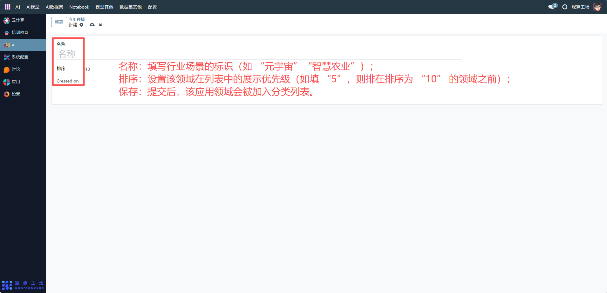
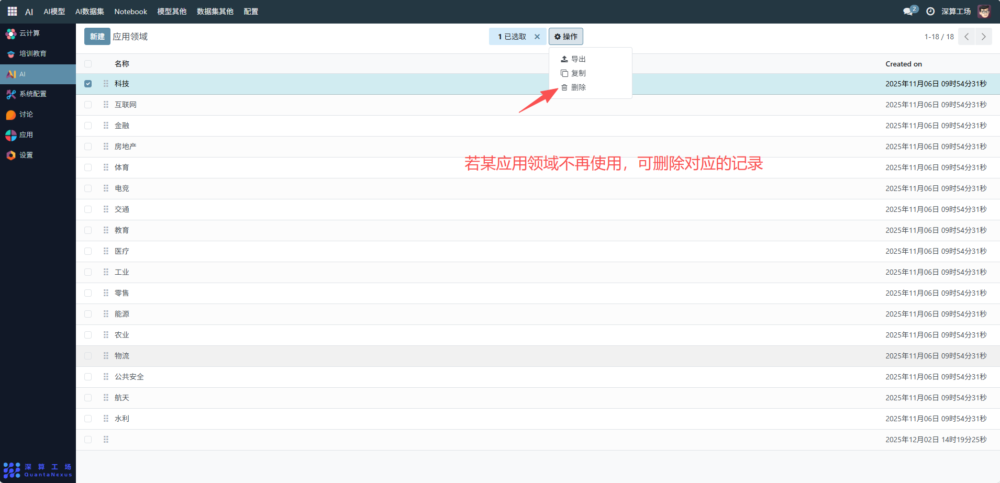

# 应用领域
“应用领域” 是AI 模型 / 数据集的行业场景分类工具，核心作用是定义不同行业的应用场景标签（如金融、医疗、工业），为 AI 资源的行业化分类、精准匹配业务需求提供统一依据，是 AI 资源业务化管理的基础模块。
## 1、新增应用领域
- 名称：填写行业场景的标识（如 “元宇宙”“智慧农业”）。
- 排序：设置该领域在列表中的展示优先级（如填 “5”，则排在排序为 “10” 的领域之前）。
- 保存：提交后，该应用领域会被加入分类列表。

## 2、管理已存在的应用领域
- 查看列表：在 “应用领域” 页面查看所有已定义的行业场景（如科技、金融等）。
- 调整排序：编辑对应领域的 “排序” 字段，优化列表的展示顺序。
- 删除领域：若某行业场景不再使用，可删除对应的记录（需确保无关联的模型 / 数据集配置）。

## 3、日常管理与运维
- 新增领域：当业务拓展新行业场景（如 “智慧养老”），按流程新增分类。
- 优化排序：根据行业需求热度调整 “排序”，让高频业务领域展示在前列。
- 关联 AI 资源：在创建模型 / 数据集时，选择对应的 “应用领域”，实现资源与业务场景的精准匹配。