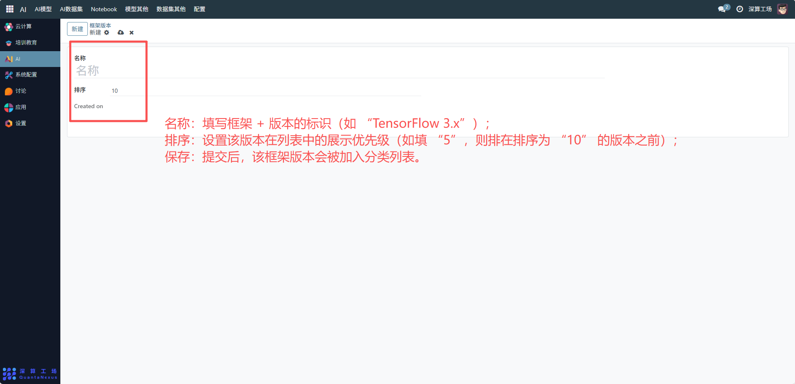
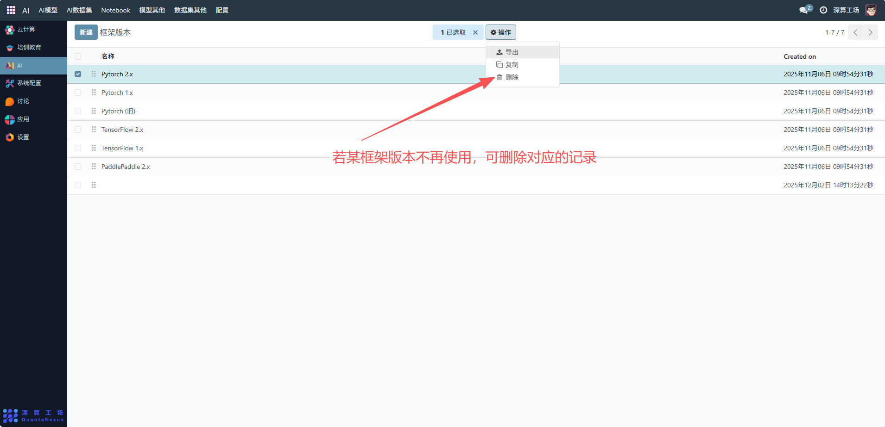

# 框架版本
“框架版本” 是AI 模型开发工具的版本分类管理工具，核心作用是定义不同 AI 开发框架的版本标签（如 PyTorch 2.x、TensorFlow 1.x），为 AI 模型的技术栈分类、环境适配提供统一依据，是 AI 模型开发资源标准化管理的基础模块。
## 1、新增框架版本
- 名称：填写框架 + 版本的标识（如 “TensorFlow 3.x”）。
- 排序：设置该版本在列表中的展示优先级（如填 “5”，则排在排序为 “10” 的版本之前）。
- 保存：提交后，该框架版本会被加入分类列表。

## 2、管理已存在的框架版本
- 查看列表：在 “框架版本” 页面查看所有已定义的开发框架版本（如 PyTorch 2.x、TensorFlow 2.x 等）。
- 调整排序：编辑对应版本的 “排序” 字段，优化列表的展示顺序。
- 删除版本：若某框架版本不再使用，可删除对应的记录（需确保无关联的模型配置）。

## 3、日常管理与运维
- 新增版本：当业务引入新的框架版本（如 “PyTorch 3.x”），按流程新增分类。
- 优化排序：根据框架的使用频率调整 “排序”，让常用版本展示在前列。
- 关联 AI 模型：在创建 AI 模型时，选择对应的 “框架版本”，实现模型技术栈的精准标识。