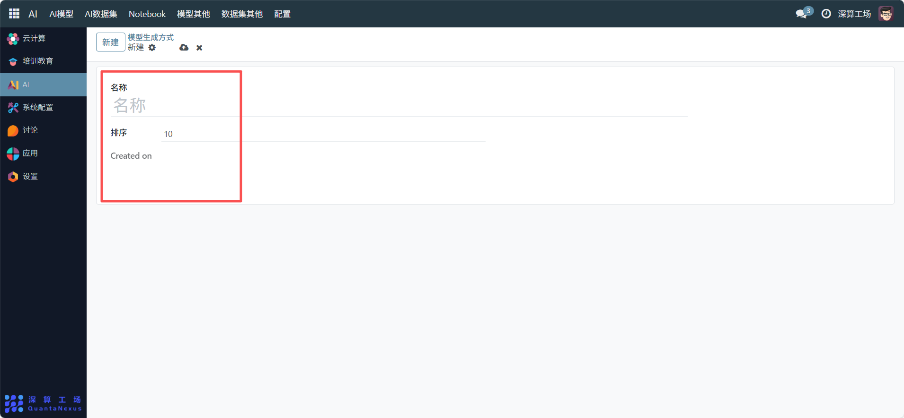
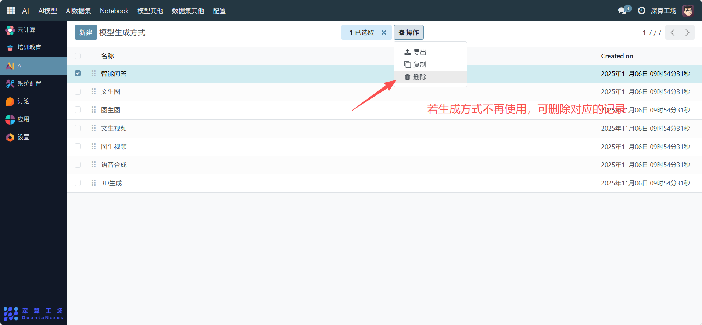

# 模型生成方式
“模型生成方式” 是AI 模型类型的标准化分类管理工具，核心作用是定义不同 AI 模型的生成场景（如智能问答、文生图），为后续模型创建、分类提供统一的类型依据，是 AI 模型资源标准化管理的基础模块。
## 1、新增模型生成方式
- 名称：填写生成方式的标识（如 “代码生成”）。
- 排序：设置该类型在列表中的展示优先级（如填 “5”，则会排在排序为 “10” 的类型之前）。
- 保存：提交配置后，该生成方式会被加入类型列表。

## 2、管理已存在的生成方式
- 查看列表：在 “模型生成方式” 页面查看所有已定义的类型（如智能问答、文生图等）。
- 调整排序：编辑对应类型的 “排序” 字段，优化列表的展示顺序。
- 删除类型：若某生成方式不再使用，可删除对应的记录（需确保无关联的模型配置）。

## 3、日常管理与运维
- 新增类型：当业务需要新的模型生成场景（如 “多模态生成”），按上述流程新增。
- 优化排序：根据业务优先级调整 “排序”，让常用生成方式展示在前列。
- 关联模型配置：在创建 AI 模型时，选择对应的 “模型生成方式”，实现模型的分类管理。