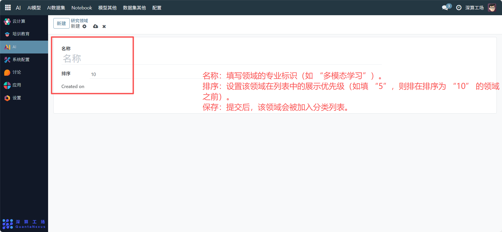
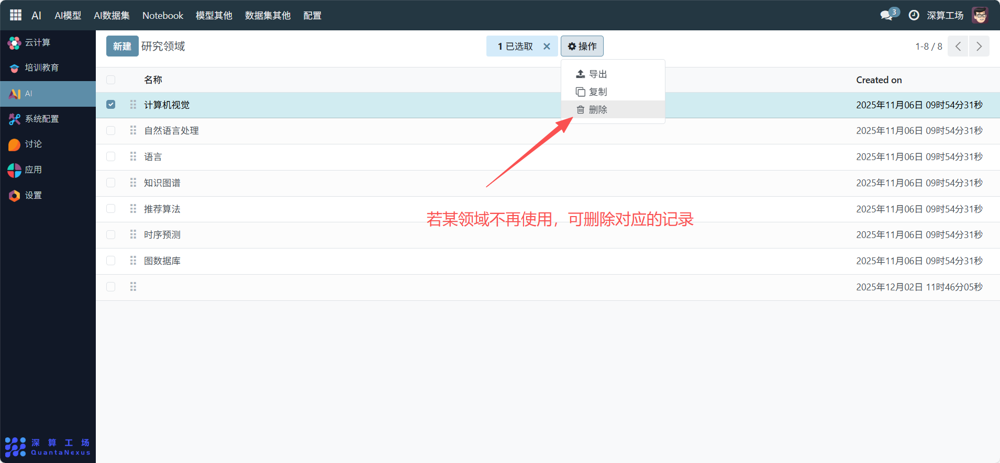

# 研究领域
“研究领域” 是AI 模型 / 数据集的专业方向分类工具，核心作用是定义不同技术领域的分类标签（如计算机视觉、自然语言处理），为 AI 资源的专业分类、检索提供统一依据，是 AI 资源标准化管理的基础模块。
## 1、新增研究领域
- 名称：填写领域的专业标识（如 “多模态学习”）。
- 排序：设置该领域在列表中的展示优先级（如填 “5”，则排在排序为 “10” 的领域之前）。
- 保存：提交后，该领域会被加入分类列表。

## 2、管理已存在的研究领域
- 查看列表：在 “研究领域” 页面查看所有已定义的专业方向（如计算机视觉、自然语言处理等）。
- 调整排序：编辑对应领域的 “排序” 字段，优化列表的展示顺序。
- 删除领域：若某领域不再使用，可删除对应的记录（需确保无关联的模型 / 数据集配置）。

## 3、日常管理与运维
- 新增领域：当业务涉及新的技术方向（如 “大模型微调”），按流程新增分类。
- 优化排序：根据业务优先级调整 “排序”，让常用领域展示在前列。
- 关联 AI 资源：在创建模型 / 数据集时，选择对应的 “研究领域”，实现资源的专业分类管理。