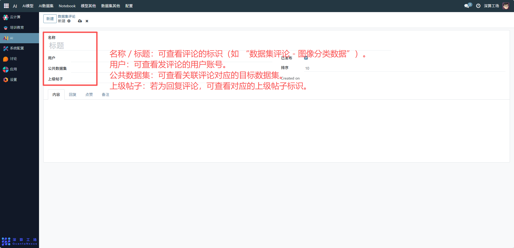
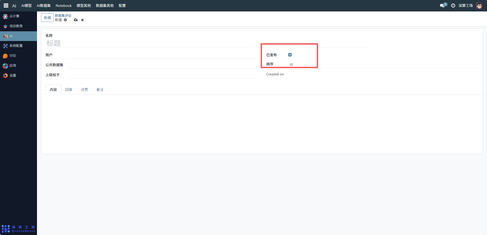
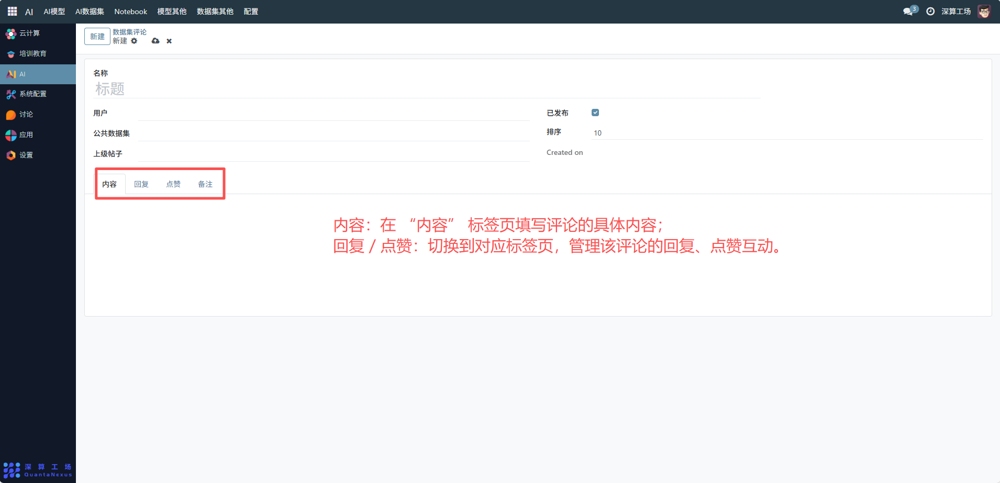

# 数据集评论
“数据集评论” 是公共数据集的互动交流工具，核心作用是记录用户对特定公共数据集的评价、建议，管理评论的发布状态与互动内容，实现用户间关于数据集的交流反馈，是提升平台数据资源互动性的核心模块。
## 核心用途
- 数据集的反馈与交流：通过 “内容” 字段填写对公共数据集的评价、使用心得等，实现用户间的信息互通。
- 评论信息的关联管理：绑定 “用户”“公共数据集”“上级帖子”，明确评论的发起者、目标数据集及所属话题。
- 评论状态的管控：通过 “已发布” 开关控制评论是否公开可见。
- 互动功能的集成：支持 “回复”“点赞” 等子功能，丰富评论的互动形式。

## 管理配置流程
### 1、评论基础信息配置
- 名称 / 标题：可查看评论的标识（如 “数据集评论 - 图像分类数据”）。
- 用户：可查看发评论的用户账号。
- 公共数据集：可查看关联评论对应的目标数据集。
- 上级帖子：若为回复评论，可查看对应的上级帖子标识。

### 2、评论状态与排序配置
- 已发布：勾选开关，将评论设为公开可见状态。
- 排序：设置评论在数据集详情页的展示优先级（数字越小越靠前）。

### 3、评论内容与互动配置
- 内容：在 “内容” 标签页填写评论的具体内容。
- 回复 / 点赞：切换到对应标签页，管理该评论的回复、点赞互动。

## 日常管理与运维
- 发布 / 隐藏评论：通过 “已发布” 开关控制评论的公开性。
- 管理互动内容：在 “回复”“点赞” 标签页，查看或处理该评论的互动信息。
- 调整展示顺序：修改 “排序” 字段，优化评论在数据集页面的展示位置。
- 关联目标数据集：确保 “公共数据集” 与评论内容对应，避免信息错位。