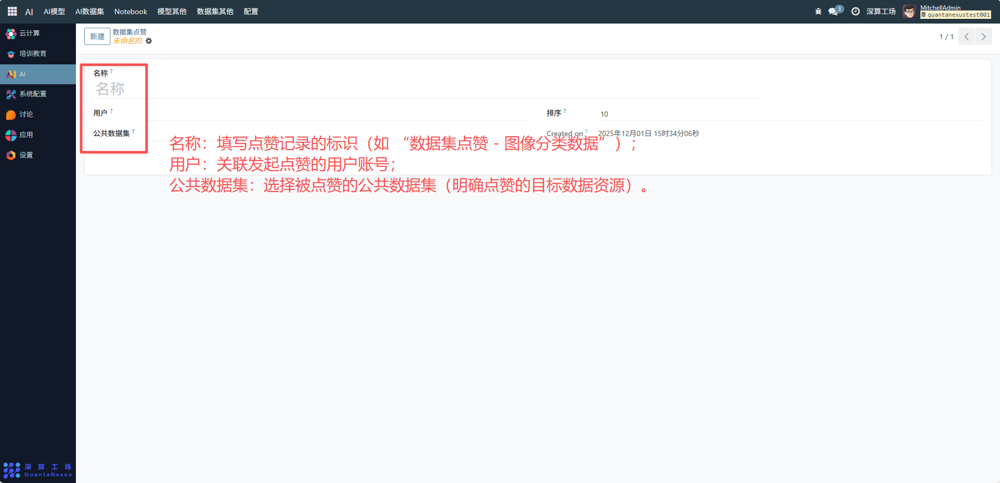

# 数据集点赞
“数据集点赞” 是针对公共数据集的互动反馈工具，核心作用是记录用户对特定公共数据集的认可行为，管理点赞功能的基础信息与展示优先级，实现数据集受欢迎程度的量化跟踪，是提升平台数据资源互动性的辅助模块。
## 核心用途
- 数据集认可度的量化记录：通过 “用户” 与 “公共数据集” 的关联，绑定点赞行为的发起者与被点赞的数据集，直观反映数据集的受欢迎程度。
- 功能展示的优先级管理：通过 “排序” 字段定义点赞功能在数据集详情页的展示顺序（这里排序为 10）。
- 互动行为的轨迹留存：记录点赞的创建时间（Created on），跟踪用户对数据集的偏好趋势。

## 管理配置流程
### 1、点赞基础信息配置
- 名称：填写点赞记录的标识（如 “数据集点赞 - 图像分类数据”）。
- 用户：关联发起点赞的用户账号；
- 公共数据集：选择被点赞的公共数据集（明确点赞的目标数据资源）。

### 2、功能优先级配置
排序：设置点赞功能在数据集页面互动功能区的展示优先级（数字越小，展示位置越靠前）。

## 日常管理与运维
- 关联点赞对象：创建点赞记录时，准确选择对应的用户和公共数据集，确保互动关系清晰。
- 调整展示顺序：根据平台互动功能布局，修改 “排序” 字段优化点赞功能的展示位置。
- 跟踪互动数据：通过 “Created on” 统计不同时间段的点赞行为，分析数据集的热度变化。