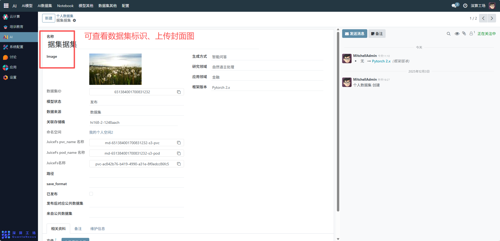
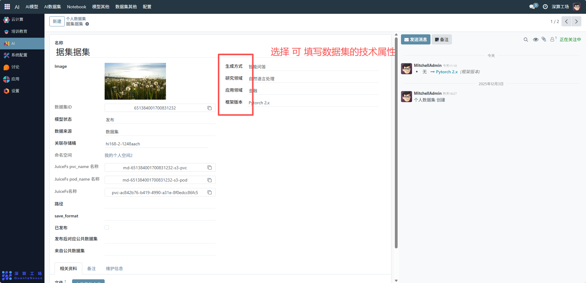
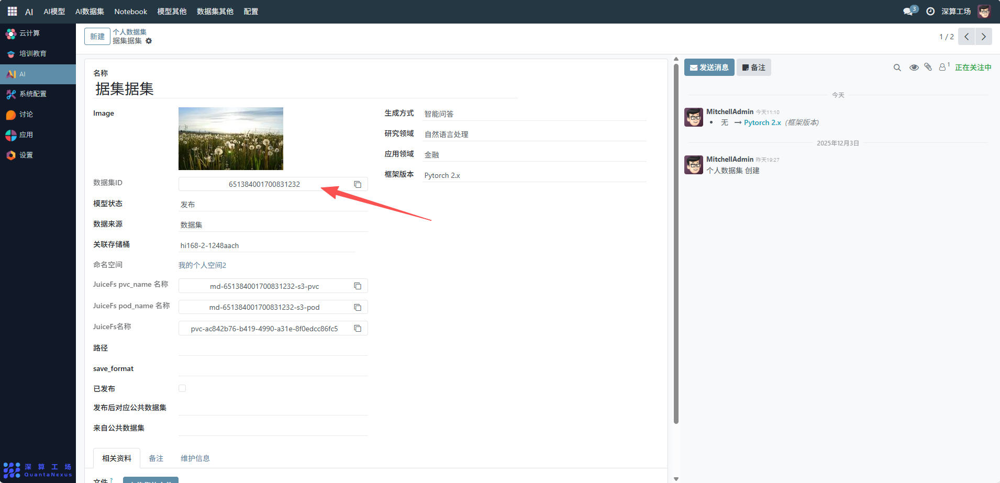
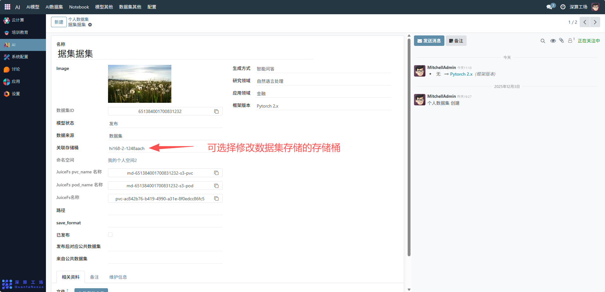
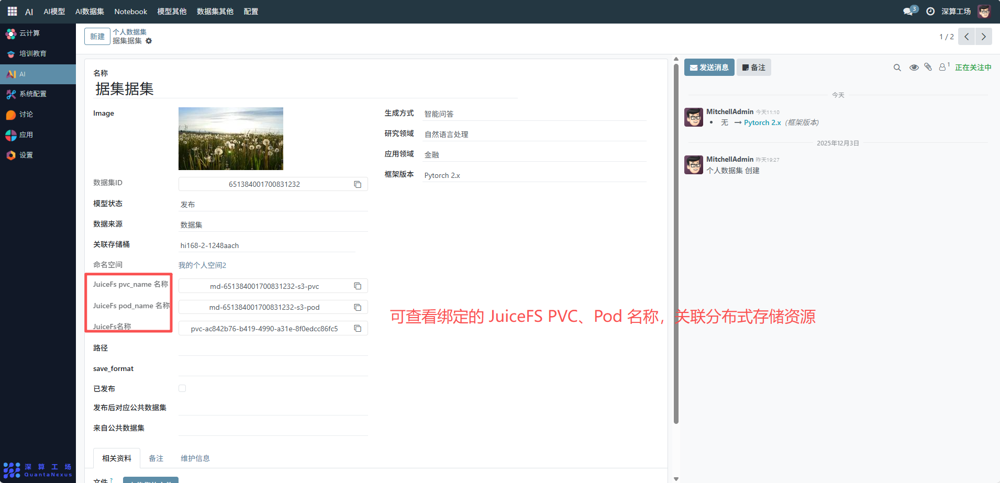
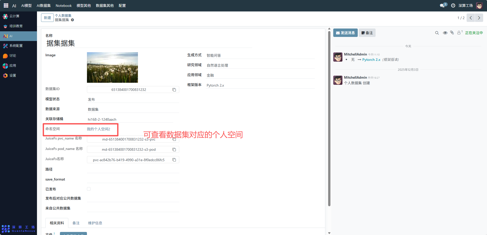
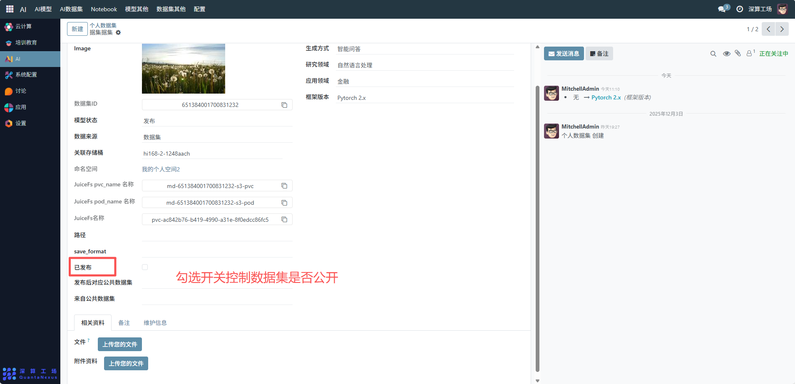
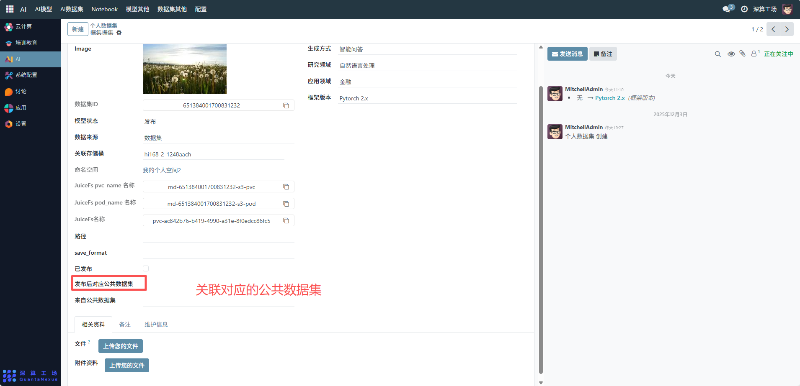

# 个人数据集
这个 “个人数据集” 是用户专属的数据资源全生命周期管理工具，核心作用是集中配置、管理用户个人所有的数据集（如这里的 “据集数据集”），关联存储资源、定义技术属性并管控发布状态，是支撑个人 AI 模型训练 / 分析的数据基础模块。
## 核心用途
数据集信息的专属记录：记录名称、数据集 ID、生成方式（如 “智能问答”）等基础属性，明确个人数据集的核心特征。
技术属性的精准定义：配置研究领域（如 “自然语言处理”）、应用领域（如 “金融”）、框架版本（如 “PyTorch 2.x”），明确数据集的适配场景。
存储资源的关联绑定：绑定存储桶、JuiceFS 分布式存储资源（PVC、Pod），明确数据集文件的存储位置。
状态与共享的灵活管控：通过 “已发布” 开关控制数据集是否公开，支持关联公共数据集实现资源复用。

## 管理配置流程
### 1、数据集基础信息配置
名称 / Image：可查看数据集标识、上传封面图（辅助识别）。

生成方式 / 研究领域 / 应用领域 / 框架版本：选择 / 填写数据集的技术属性（如生成方式选 “智能问答”）。

数据集 ID：系统自动生成或手动填写唯一标识。

### 2、存储资源关联配置
关联存储桶：可选择修改数据集存储的存储桶（如 “hi168-2-1248aach”）。

JuiceFS 资源：可查看绑定的 JuiceFS PVC、Pod 名称，关联分布式存储资源。

命名空间：可查看数据集对应的个人空间（如 “我的个人空间 2”）。

### 3、状态与共享配置
已发布：勾选开关控制数据集是否公开。

发布后对应公共数据集 / 来自公共数据集：关联对应的公共数据集（若需复用或同步公共数据）。

## 日常管理与运维
更新数据信息：修改技术属性、存储位置等信息，同步更新配置字段。
调整发布状态：通过 “已发布” 开关控制数据集的公开性。
维护存储资源：若存储桶、JuiceFS 资源变更，同步更新对应配置。
补充辅助资料：定期上传维护信息、备注，提升数据集的易用性。