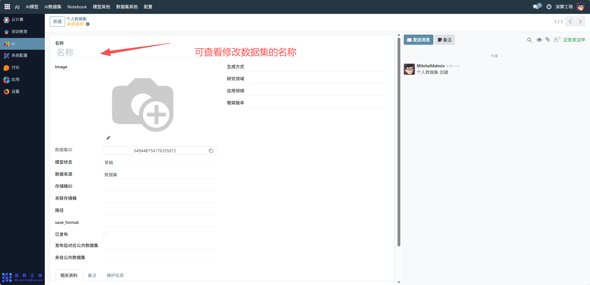
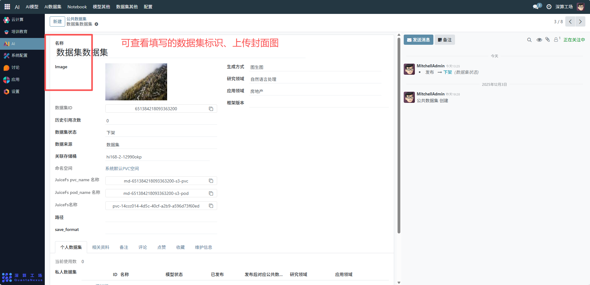
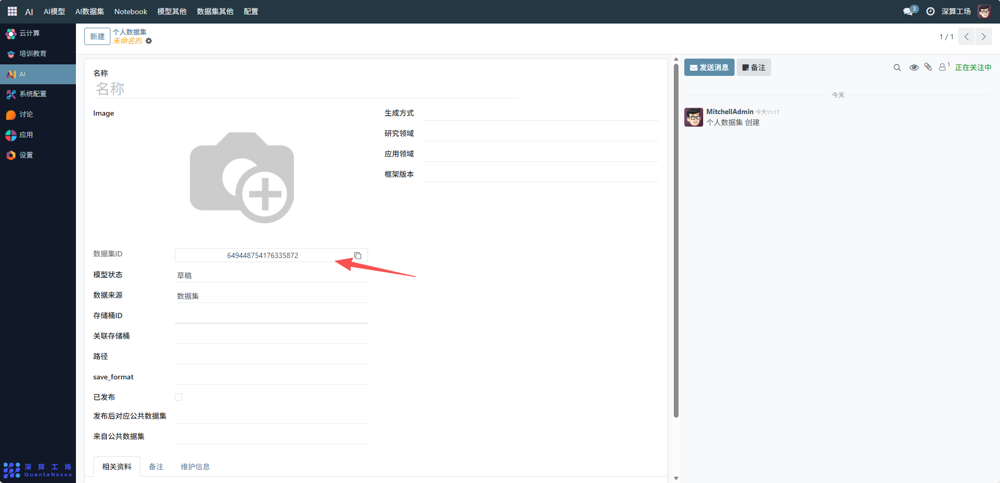
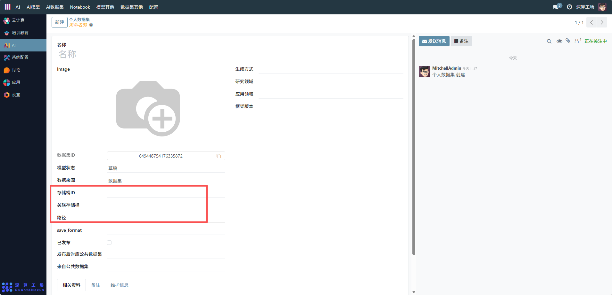
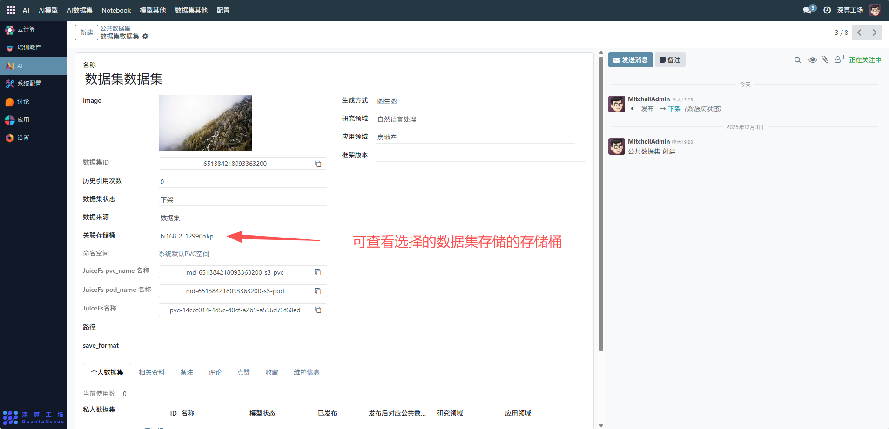
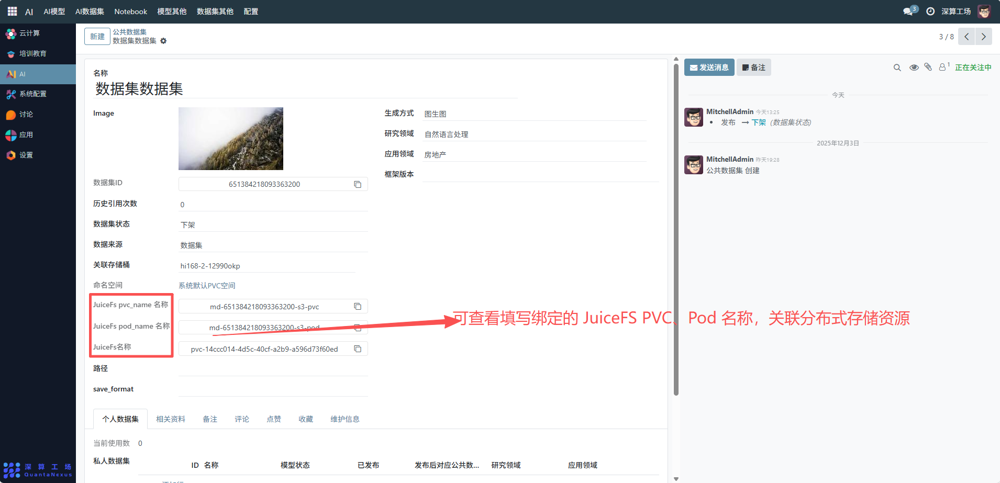

# 个人数据集
“个人数据集” 是用户个人数据资源的全流程管理工具，核心作用是记录、配置个人所有的数据集信息（标识、存储位置、领域属性等），实现数据集从创建、发布到存储的专属管理，是个人 AI 训练 / 分析数据资源的核心管理模块。
## 核心用途
- 数据集信息的专属记录：通过 “名称”“数据集 ID” 明确个人数据集的唯一标识，区分不同数据资源。
- 数据属性的精准定义：配置生成方式、研究 / 应用领域，明确数据集的用途（如 “计算机视觉” 领域的智能问答数据集）。
- 存储与关联管理：绑定云存储桶（如 “hi168-2-6498del9”）及路径，明确数据集的存储位置。
- 发布与共享管控：通过 “已发布” 开关控制数据集是否公开，支持关联公共数据集实现资源复用。

## 管理配置流程
### 1、数据集基础信息配置
- 名称：可查看修改数据集的名称（如 “挂载测试数据集 2”）。

- Image：可查看上传数据集对应的封面图（可选，辅助识别）。

- 数据集 ID：系统自动生成或手动填写唯一标识（如 “649434698677755904”）；

- 存储桶 ID / 关联存储桶 / 路径：选择 / 填写数据集存储的云存储桶及具体路径（需提前配置云存储账号）。

### 2、数据属性与状态配置
- 生成方式 / 研究领域 / 应用领域：填写数据集的创建方式（如 “智能问答”）与适用领域。
- 已发布：勾选开关，将数据集设为公开可用状态。
- 发布后对应公共数据集 / 来自公共数据集：关联对应的公共数据集（若需复用或同步公共数据）。

### 3、辅助资源管理
- 相关资料 / 附件资料：点击 “上传您的文件”，上传数据集的说明文档、数据样本等辅助材料。
- 备注 / 维护信息：补充数据集的更新记录、使用说明等内容。

## 日常管理与运维
- 更新数据信息：若数据集用途或存储位置变更，修改对应字段并保存。
- 调整发布状态：通过 “已发布” 开关控制数据集的公开性。
- 管理存储资源：若数据集文件更新，同步更新存储桶中的文件及配置中的 “路径”。
- 归档辅助材料：定期补充资料、维护信息，提升数据集的易用性。
- “个人数据集” 是个人数据资源的 “专属管理中枢”，通过集中配置信息、状态与存储，实现了个人数据集的有序管理，是支撑 AI 模型训练 / 分析的数据基础工具。