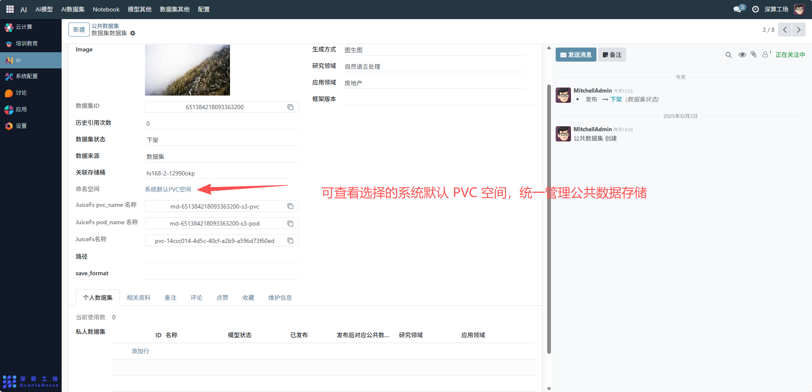
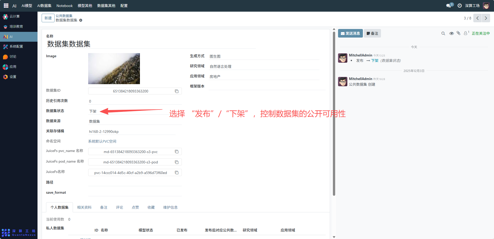
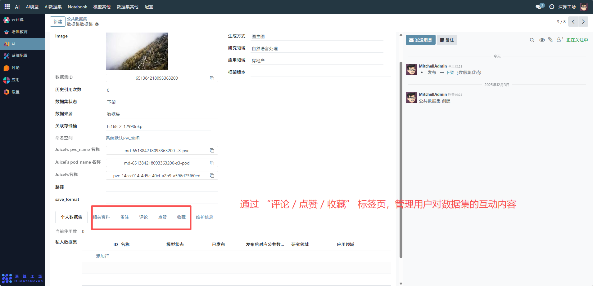

# 公共数据集
这个 “公共数据集” 是平台级共享数据资源的全生命周期管理工具，核心作用是集中配置、发布可供平台所有用户复用的数据集（如这里的 “数据集数据集”），关联存储资源、定义技术属性并跟踪使用数据，是平台 AI 训练 / 分析数据资源开放复用的核心模块。
## 核心用途
- 数据资源的公开共享：通过平台公开机制，向所有用户开放数据集，提升数据资源利用率。
- 数据集信息的统一登记：记录名称、数据集 ID、生成方式（如图生图）等基础属性，明确公共数据集的核心特征。
- 技术与业务属性的定义：配置研究领域（如自然语言处理）、应用领域（如房地产），明确数据集的适配场景。
- 存储资源的关联绑定：绑定存储桶、JuiceFS 分布式存储资源（PVC、Pod），明确数据集文件的存储位置。
- 状态与使用的跟踪管控：通过 “数据集状态”（发布 / 下架）管控可用性，统计 “历史引用次数” 跟踪数据复用热度。

## 管理配置流程
### 1、数据集基础信息配置
名称 / Image：可查看填写的数据集标识、上传封面图（辅助用户识别）。

生成方式 / 研究领域 / 应用领域：选择 / 填写数据集的技术与业务属性（如生成方式选 “图生图”）。

数据集 ID：系统自动生成或手动填写唯一标识。

### 2、存储资源关联配置
关联存储桶：可查看选择的数据集存储的存储桶（如 “hi168-2-12990okp”）。

JuiceFS 资源：可查看填写绑定的 JuiceFS PVC、Pod 名称，关联分布式存储资源。

命名空间：可查看选择的系统默认 PVC 空间，统一管理公共数据存储。

### 3、状态与互动配置
数据集状态：选择 “发布”/“下架”，控制数据集的公开可用性。

互动功能：通过 “评论 / 点赞 / 收藏” 标签页，管理用户对数据集的互动内容。

## 日常管理与运维
- 调整发布状态：修改 “数据集状态” 为 “发布”/“下架”，控制数据的公开性。
- 更新资源信息：若存储桶、JuiceFS 资源变更，同步更新对应配置字段。
- 跟踪使用数据：通过 “历史引用次数” 统计数据集的复用热度。
- 维护辅助资料：定期补充备注、更新相关资料，提升数据集的易用性。