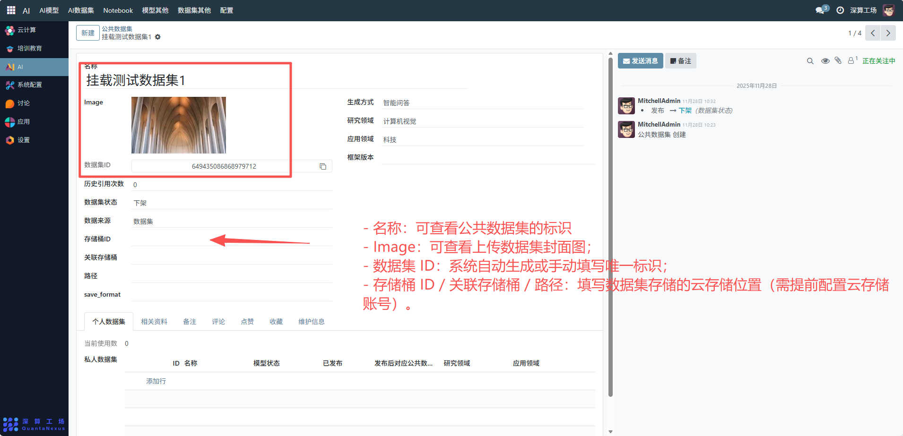
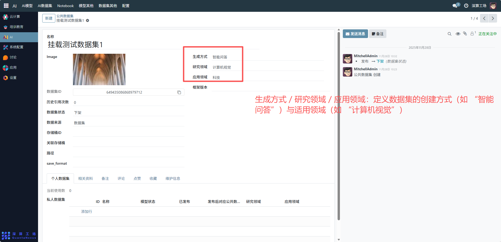
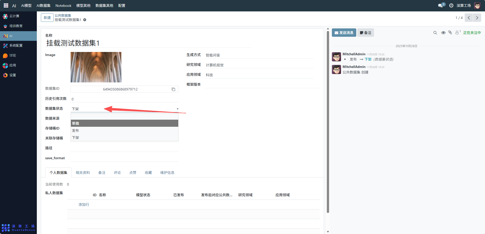
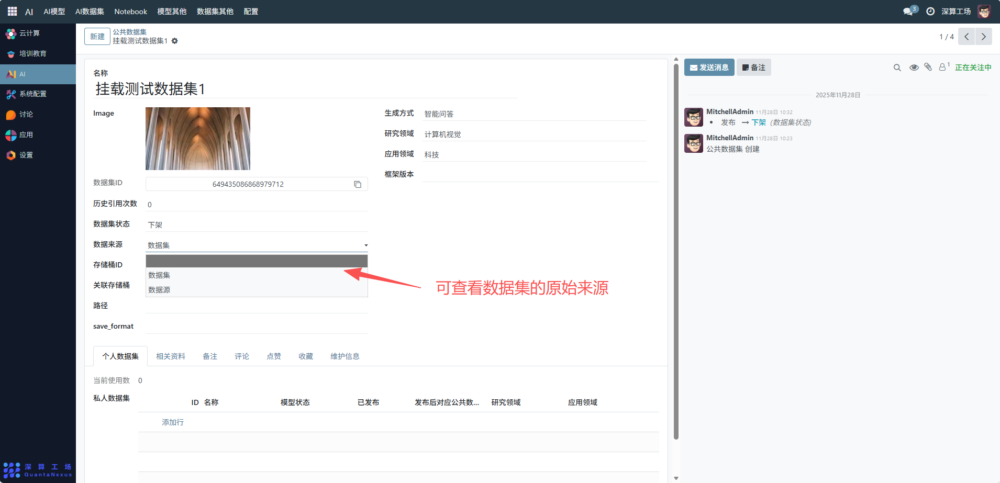
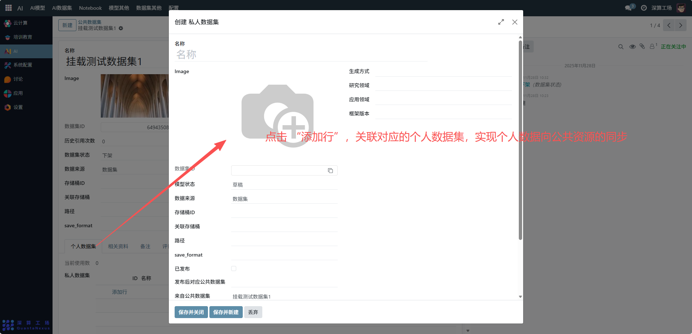
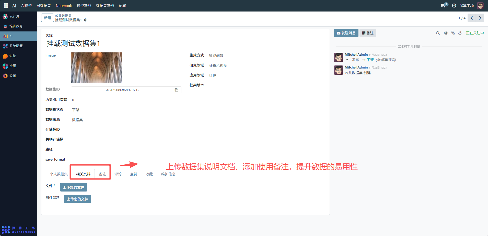

# 公共数据集
“公共数据集” 是平台级共享数据资源的管理工具，核心作用是集中配置、发布可供平台所有用户复用的数据集，实现数据资源的公开共享、统一管控与使用统计，是平台 AI 训练 / 分析数据资源开放复用的核心模块。
## 核心用途
- 数据资源的公开共享：通过 “公共” 属性向平台所有用户开放数据集，提升数据资源的利用率。
- 数据集信息的统一登记：记录名称、数据集 ID、领域属性等，明确公共数据集的基础信息。
- 使用与状态的全流程跟踪：统计 “历史引用次数”“当前使用数”，跟踪数据的复用情况；通过 “数据集状态”（上架 / 下架）管控数据的可用性。
- 个人与公共数据的关联：支持绑定个人数据集，实现个人数据向公共资源的转化与同步。

## 管理配置流程
### 1、数据集基础信息配置
- 名称：可查看公共数据集的标识（如 “挂载测试数据集 1”）。
- Image：可查看上传数据集封面图（辅助用户识别）。
- 数据集 ID：系统自动生成或手动填写唯一标识（如 “649435086868979712”）。
- 存储桶 ID / 关联存储桶 / 路径：填写数据集存储的云存储位置（需提前配置云存储账号）。

### 2、数据属性与状态配置
- 生成方式 / 研究领域 / 应用领域：定义数据集的创建方式（如 “智能问答”）与适用领域（如 “计算机视觉”）。

- 数据集状态：通过 “发布 / 下架” 操作管控数据集的公开可用性（当前为 “下架” 状态，点击 “发布” 可开放）。

- 数据来源：可查看数据集的原始来源（如 “数据集”）。

### 3、关联与辅助信息管理
- 个人数据集（标签页）：点击 “添加行”，关联对应的个人数据集，实现个人数据向公共资源的同步。

- 相关资料 / 备注：上传数据集说明文档、添加使用备注，提升数据的易用性。

## 日常管理与运维
- 上架 / 下架数据集：通过 “数据集状态” 操作，控制数据集是否对平台用户开放。
- 统计使用数据：通过 “历史引用次数”“当前使用数” 跟踪数据的复用热度。
- 更新数据信息：若数据集属性或存储位置变更，修改对应字段并保存。
- 维护关联数据：同步更新关联的个人数据集信息，保障数据一致性。