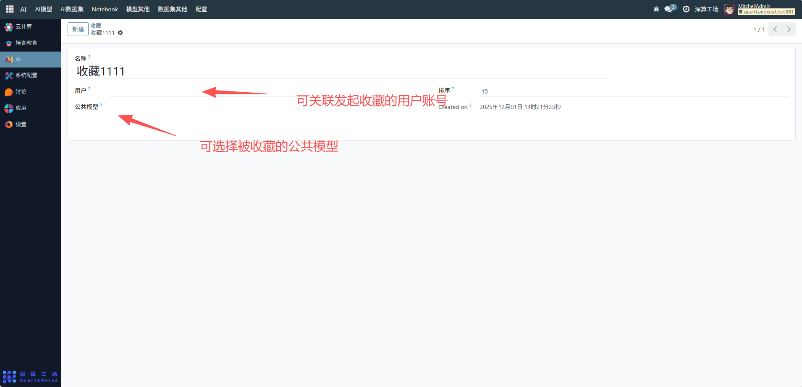

# 收藏
“收藏” 是平台内容（如公共模型）的个性化管理工具，核心作用是记录用户对特定内容的收藏行为，同时配置收藏功能的基础信息，实现用户个性化资源的集中管理，是提升平台内容复用效率的辅助模块。
## 核心用途
- 个性化资源的关联记录：通过 “用户”“公共模型” 字段，绑定收藏的发起者与被收藏的内容，将优质资源纳入用户的个性化收藏列表。
- 功能展示的优先级管理：通过 “排序” 字段定义收藏功能在平台中的展示顺序（这里排序为 10）。
收藏行为的轨迹留存：记录收藏的创建时间（Created on），跟踪用户的资源偏好。
## 管理配置流程
### 1、基础信息配置
- 名称：可查看修改收藏功能的标识（如 “公共模型收藏”）。
- 用户：可关联发起收藏的用户账号。
- 公共模型：可选择被收藏的公共模型（明确收藏的目标内容）。
- 排序：设置收藏功能在平台功能列表中的展示优先级（数字越小，展示位置越靠前）。

## 日常管理与运维
- 关联收藏内容：创建收藏记录时，选择对应的用户和目标内容（如公共模型），完成个性化收藏。
- 调整功能优先级：根据平台功能布局，修改 “排序” 字段调整收藏功能的展示顺序。
- 跟踪收藏轨迹：通过 “Created on” 查看收藏时间，分析用户的资源偏好。