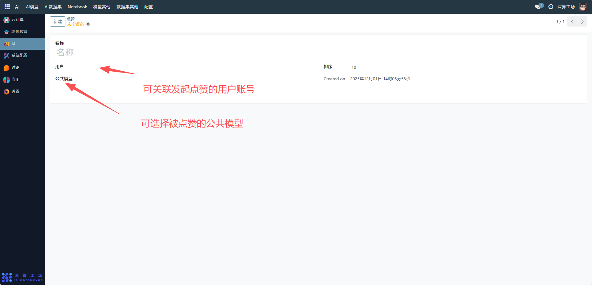

# 点赞
## 核心用途
- 互动行为的关联记录：通过 “用户”“公共模型” 字段，绑定点赞的发起者与被点赞的内容，明确互动关系。
- 功能排序管理：通过 “排序” 字段定义点赞功能在平台中的展示优先级（这里排序为 10）。
- 互动数据的基础登记：记录点赞行为的创建时间（Created on），留存互动轨迹。

## 管理配置流程
### 1、基础信息配置
- 名称：可查看修改点赞功能的标识（如 “公共模型点赞”）。
- 用户：关联发起点赞的用户账号。
- 公共模型：可选择被点赞的公共模型（这里是关联的具体模型）。
- 排序：设置点赞功能在平台功能列表中的展示优先级（数字越小优先级越高）。

## 日常管理与运维
- 关联互动内容：在创建点赞记录时，选择对应的用户和被点赞内容（如公共模型）。
- 调整展示优先级：根据平台功能布局，修改 “排序” 字段调整点赞功能的展示顺序。
- 查看互动轨迹：通过 “Created on” 跟踪点赞行为的时间，统计内容的受欢迎程度。