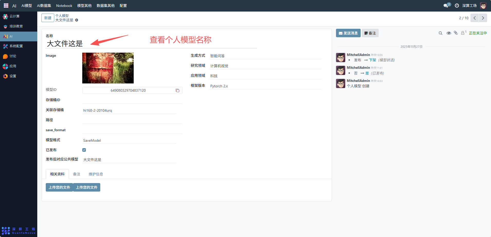
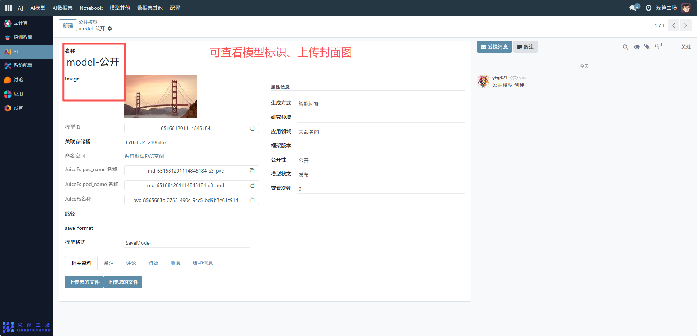
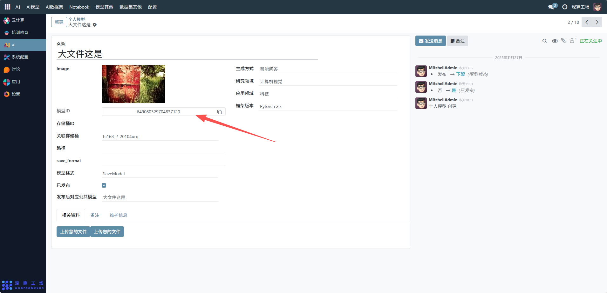
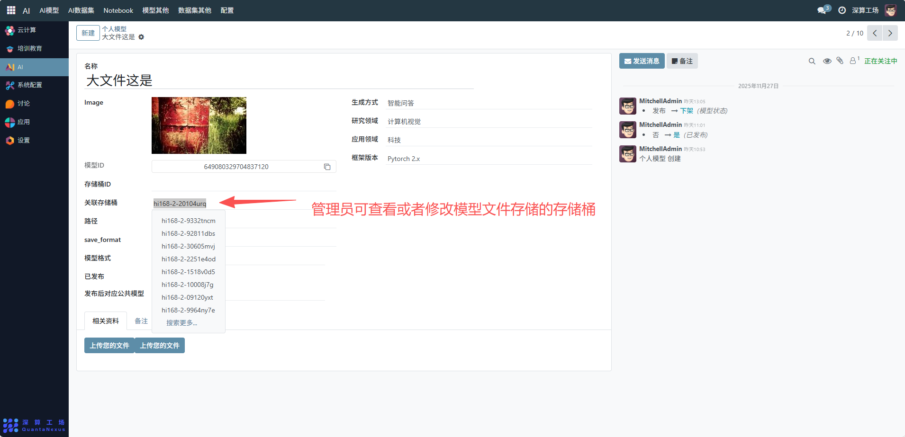
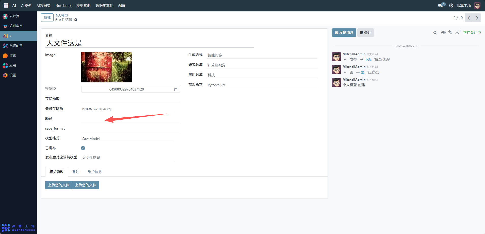
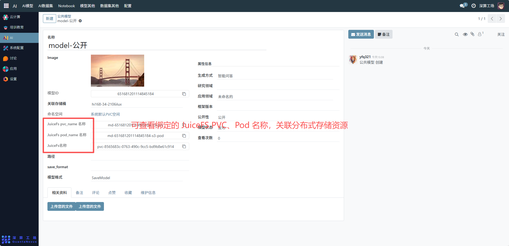
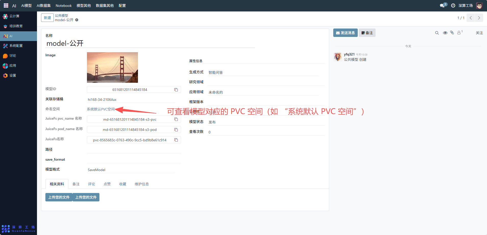

# 个人模型
“个人模型” 是用户个人 AI 模型的全生命周期管理工具，核心作用是记录、配置个人创建 / 使用的 AI 模型信息（如模型标识、存储位置、技术参数），实现模型从创建、发布到存储的全流程管控，是个人 AI 模型资源管理的核心模块。
## 核心用途
- 模型信息的集中记录：通过 “名称”“模型 ID”“存储桶 ID” 等字段，明确个人模型的唯一标识与存储位置；
- 模型技术参数的配置：定义模型的生成方式、研究 / 应用领域、框架版本（如 PyTorch 2.x）等，明确模型的技术属性；
- 模型状态的管控：通过 “已发布” 开关控制模型是否公开可用，同步管理 “发布 / 下架” 状态；
- 模型资源的关联管理：关联存储桶（如 “hi168-2-20104urq”），明确模型文件的存储位置。

## 管理配置流程
### 1、模型基础信息配置
- 名称：可查看个人模型的标识；

- Image：可查看上传模型对应的封面图（可选，用于可视化识别）；

- 模型 ID：系统自动生成或手动填写唯一标识（如 “649080329704837120”）；

- 存储桶 ID / 关联存储桶：选择 / 填写模型文件存储的云存储桶（需提前配置云存储账号）；

- 路径：填写模型文件在存储桶中的具体路径。

### 2、模型技术参数配置
- 生成方式：选择模型的创建方式（如 “智能问答”）；
- 研究 / 应用领域：填写模型对应的领域（如 “计算机视觉”“科技”）；
- 框架版本：选择模型使用的技术框架（如 “PyTorch 2.x”）；
- 模型格式：填写模型的存储格式（如 “SaveModel”）。

### 3、模型状态与资源管理
- 已发布：勾选开关，将模型设为公开可用状态；
- 发布后对应公共模型：填写关联的公共模型名称（若需关联）。
- 相关资料：点击 “上传您的文件”，上传模型的说明文档、训练数据等辅助材料。

## 日常管理与运维
- 更新模型信息：若模型技术参数变更（如框架版本升级），修改对应字段并保存；
- 调整发布状态：通过 “已发布” 开关或右侧状态操作（发布 / 下架），控制模型的可用性。
- 管理存储资源：若模型文件更新，同步更新存储桶中的文件及配置中的 “路径”。
- 归档相关资料：定期补充模型的维护信息、备注，完善模型的管理记录。