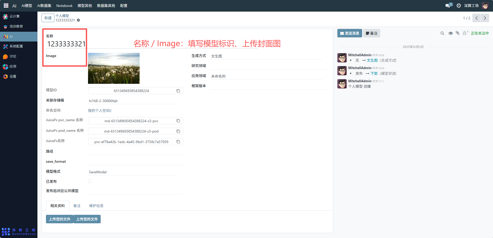
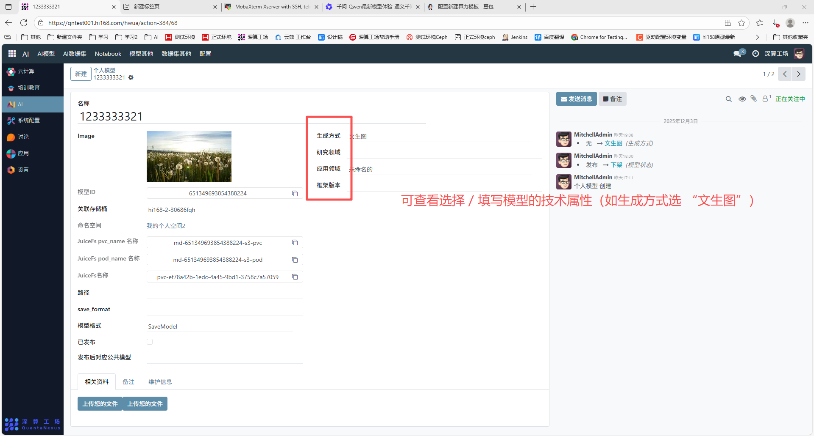
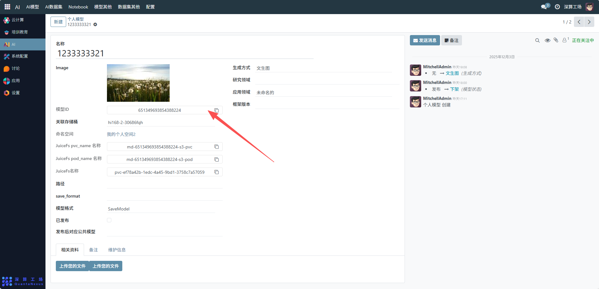
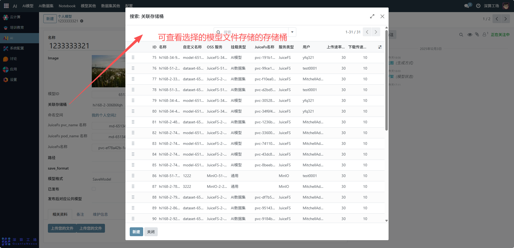
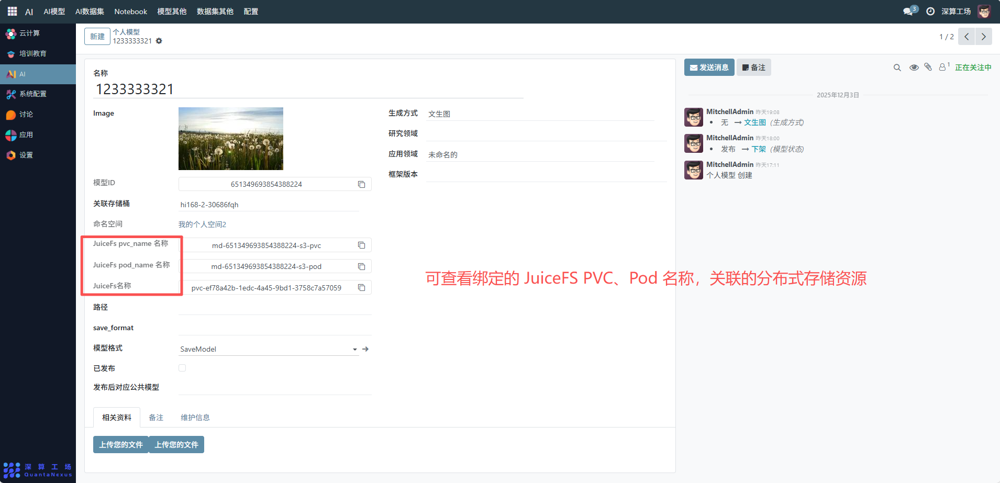
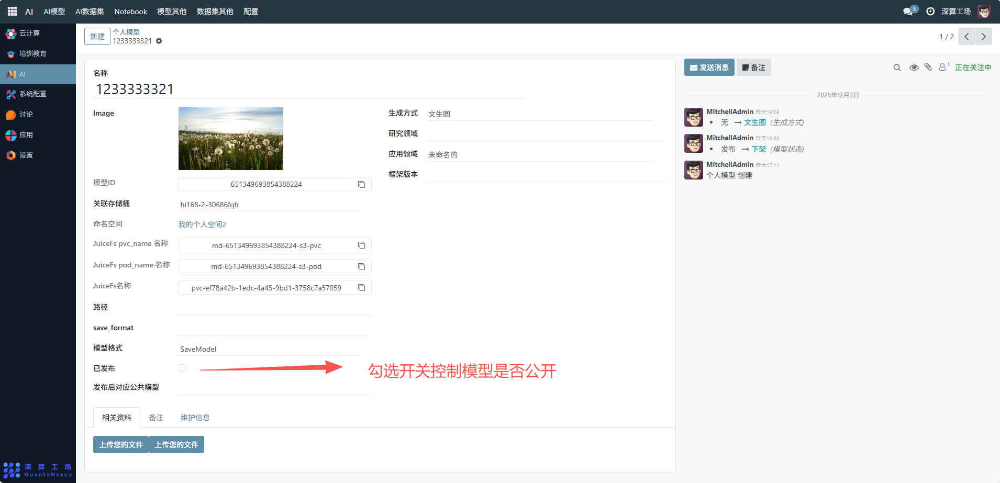

# 个人模型
这个 “个人模型” 是用户专属的 AI 模型全生命周期管理工具，核心作用是集中配置、管理用户个人创建的 AI 模型（如这里的 “文生图” 模型）的基础信息、存储资源、发布状态等，实现从模型创建到资源关联的全流程管控，是个人 AI 模型资源的核心管理模块。
## 核心用途
- 模型信息的专属记录：记录名称、模型 ID、生成方式（如 “文生图”）等基础属性，明确个人模型的核心特征；
- 存储资源的关联绑定：绑定云存储桶、JuiceFS 存储资源（PVC、Pod），明确模型文件的存储位置；
- 模型状态的灵活管控：通过 “已发布” 开关控制模型是否公开，支持 “发布 / 下架” 状态切换；
- 辅助资源的集中归档：上传相关资料、维护信息，完善模型的配套文档。

## 管理配置流程
### 1、模型基础信息配置
名称 / Image：填写模型标识、上传封面图（辅助识别）；

生成方式 / 研究领域 / 应用领域 / 框架版本：可查看选择 / 填写模型的技术属性（如生成方式选 “文生图”）；

模型 ID：系统自动生成或手动填写唯一标识。

### 2、存储资源关联配置
关联存储桶：可查看选择的模型文件存储的存储桶（如 “hi168-2-30686fqh”）；

JuiceFS 资源：可查看绑定的 JuiceFS PVC、Pod 名称，关联的分布式存储资源。

### 3、状态与辅助资源配置
已发布：勾选开关控制模型是否公开；

## 日常管理与运维
更新模型信息：修改生成方式、应用领域等技术属性，同步更新存储资源信息；
调整发布状态：通过 “已发布” 开关或右侧状态操作（发布 / 下架），控制模型可用性；
维护存储资源：若存储桶、JuiceFS 资源变更，同步更新对应配置字段；
补充辅助资料：定期上传维护信息、备注，完善模型的管理记录。