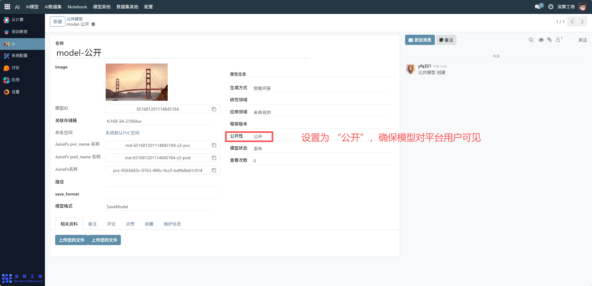
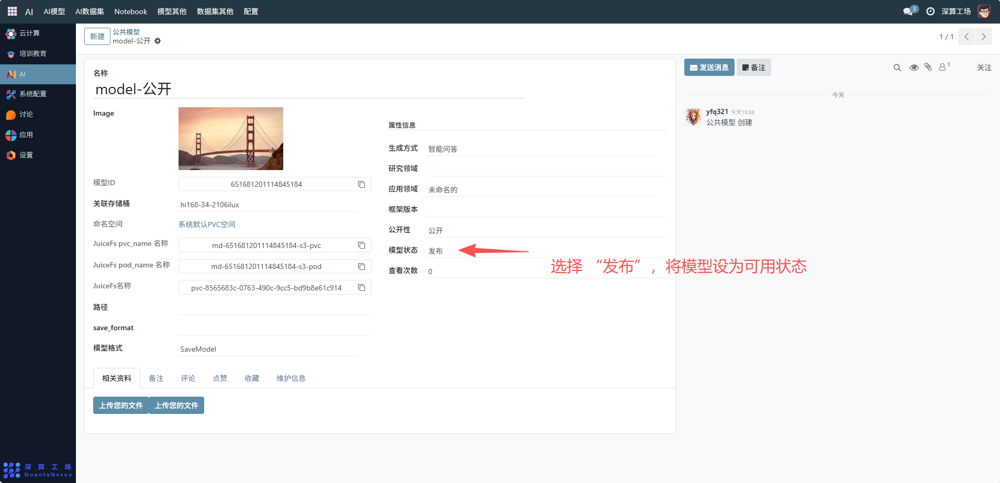
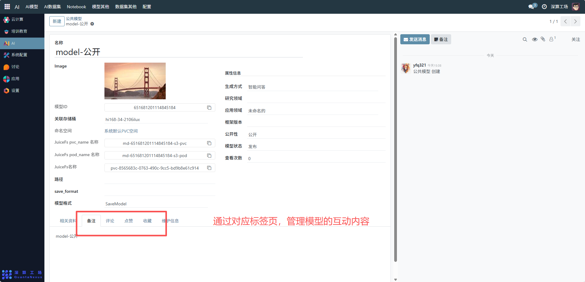

# 公共模型
这个 “公共模型” 是平台级共享 AI 模型的全生命周期管理工具，核心作用是集中配置、发布可供平台所有用户使用的 AI 模型（如这里的 “智能问答” 模型），实现模型的公开共享、资源关联与状态跟踪，是平台 AI 资源开放复用的核心模块。
## 核心用途
模型的公开共享管理：通过 “公开性” 字段设置为 “公开”，向平台所有用户开放模型；
模型信息的统一登记：记录名称、模型 ID、生成方式（如 “智能问答”）等基础属性，明确公共模型的核心特征；
存储与资源的关联绑定：绑定存储桶、JuiceFS 分布式存储资源（PVC、Pod），明确模型文件的存储位置；
状态与数据的跟踪管控：通过 “模型状态”（发布 / 下架）管控可用性，统计 “查看次数” 跟踪模型热度；
辅助资源的集中归档：支持上传相关资料、关联评论 / 点赞，完善模型的配套互动与文档。

## 管理配置流程
### 1、模型基础信息配置
名称 / Image：可查看模型标识、上传封面图（辅助用户识别）。

生成方式 / 研究领域 / 应用领域 / 框架版本：可查看选择的模型的技术属性（如生成方式选 “智能问答”）。

模型 ID：系统自动生成或手动填写唯一标识。

### 2、存储资源关联配置
关联存储桶：可查看模型文件存储的存储桶（如 “hi168-34-2106lux”）。

JuiceFS 资源：可查看绑定的 JuiceFS PVC、Pod 名称，关联分布式存储资源。

命名空间：可查看模型对应的 PVC 空间（如 “系统默认 PVC 空间”）。

### 3、公开性与状态配置
公开性：设置为 “公开”，确保模型对平台用户可见。

模型状态：选择 “发布”，将模型设为可用状态。

### 4、辅助资源管理
评论 / 点赞 / 收藏：通过对应标签页，管理模型的互动内容。

## 日常管理与运维
调整发布状态：修改 “模型状态” 为 “下架” 可暂停模型的公开使用。
更新资源信息：若存储桶、JuiceFS 资源变更，同步更新对应配置字段。
跟踪使用数据：通过 “查看次数” 统计模型的受欢迎程度。
维护辅助资料：定期补充备注、更新相关资料，提升模型的易用性。