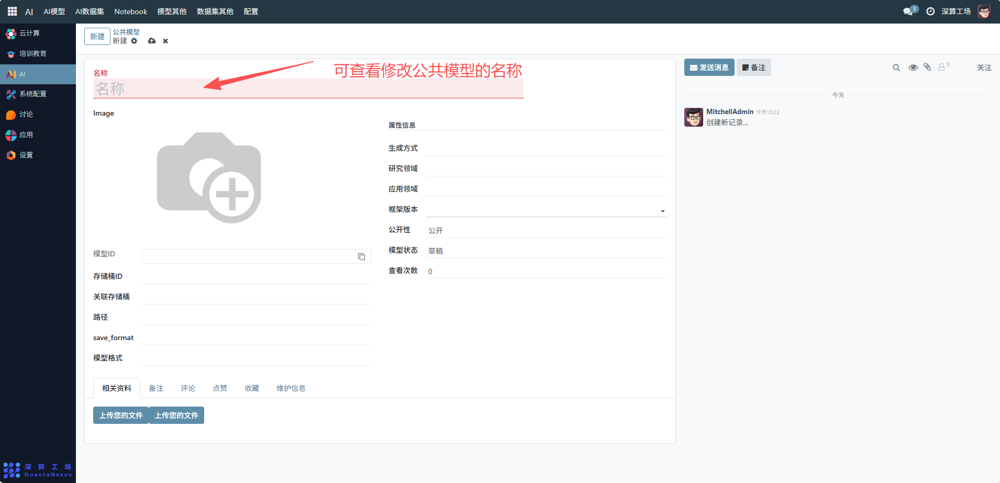
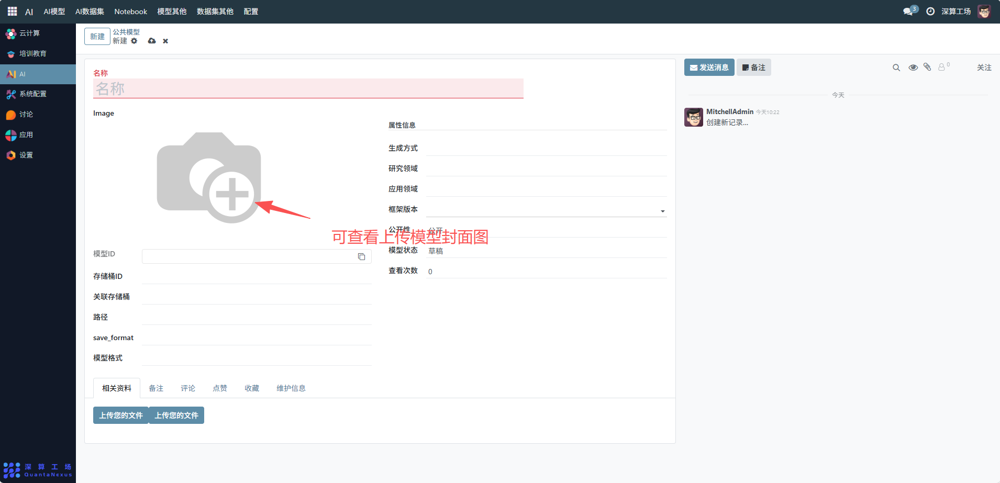
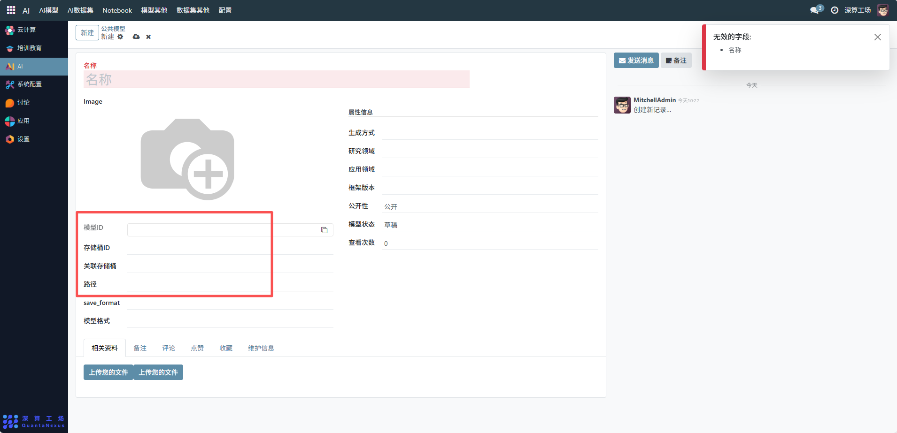
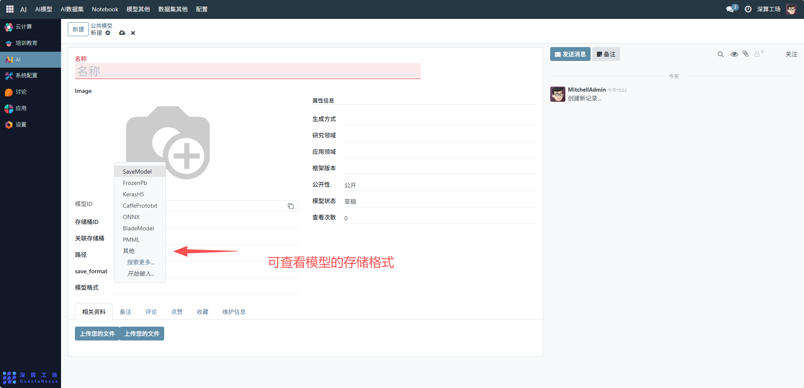
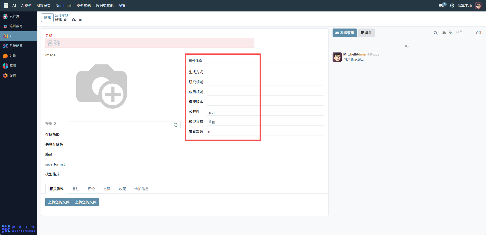

# 公共模型
“公共模型” 是平台级共享 AI 模型的管理工具，核心作用是集中配置、发布可供平台内所有用户使用的 AI 模型，实现模型的公开共享、统一管理与状态跟踪，是平台 AI 资源开放复用的核心模块。
## 核心用途
- 模型的公开共享管理：通过 “公开性” 字段设置模型为 “公开”，供平台用户共同使用。
- 模型信息的统一登记：记录名称、模型 ID、存储位置等信息，明确公共模型的基础属性。
- 模型状态的全流程管控：通过 “模型状态”（草稿 / 已发布）跟踪模型的发布进度。
- 模型资源的关联与统计：关联存储桶、记录查看次数，实现资源管理与使用数据统计。
- 辅助信息的集中归档：支持上传相关资料、添加备注 / 评论，完善模型的使用说明。

## 管理配置流程
### 1、模型基础信息配置
名称：可查看修改公共模型的标识（如 “通用图像分类模型”）。

Image：可查看上传模型封面图（点击 “+” 图标选择图片）。

模型 ID / 存储桶 ID / 关联存储桶 / 路径：可查看修改模型的唯一标识、存储位置（需提前配置云存储账号）。

save_format / 模型格式：可查看模型的存储格式（如 “SaveModel”）。

### 2、模型属性与状态配置
- 生成方式 / 研究领域 / 应用领域 / 框架版本：填写模型的技术属性（如生成方式 “预训练微调”、框架版本 “PyTorch 2.x”）。
- 公开性：默认选择 “公开”，确保模型对平台用户可见。
- 模型状态：初始为 “草稿”，完成配置后可修改为 “已发布”。

### 3、辅助资源与信息管理
- 相关资料：点击 “上传您的文件”，上传模型说明文档、使用教程等材料。
- 备注 / 评论 / 维护信息：补充模型的使用说明、更新记录等内容。
## 日常管理与运维
- 发布 / 下架模型：将 “模型状态” 从 “草稿” 改为 “已发布” 实现公开，反之则下架。
- 更新模型信息：若技术参数变更（如框架版本升级），修改对应字段并保存。
- 统计使用数据：通过 “查看次数” 跟踪模型的使用热度。
- 维护模型资料：定期补充备注、更新相关资料，提升模型的易用性。