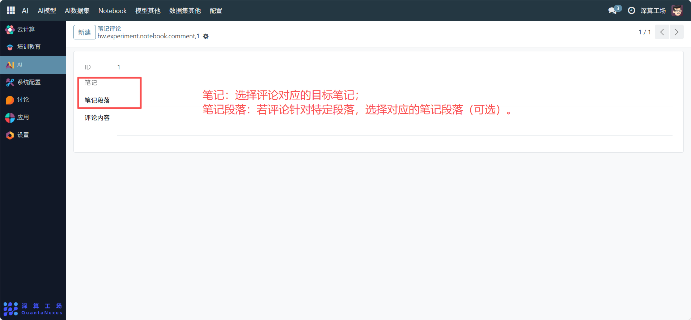
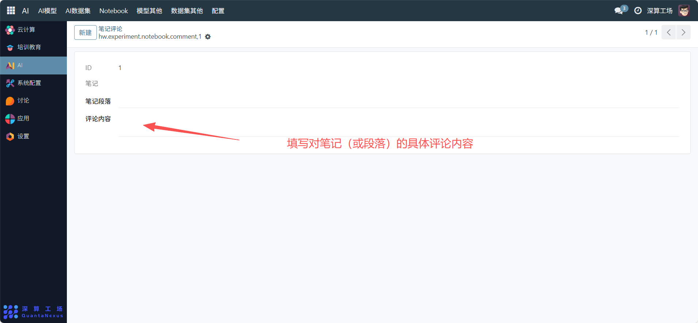

# 笔记评论
“笔记评论” 是Notebook 笔记的互动交流工具，核心作用是记录用户对特定笔记（或笔记段落）的评论内容，实现对笔记的反馈、讨论，是提升笔记内容互动性的辅助模块。
## 1、评论关联信息配置
- 笔记：可查看评论对应的目标笔记。
- 笔记段落：若评论针对特定段落，可查看关联对应的笔记段落（可选）。

## 2、评论内容配置
- 评论内容：填写对笔记（或段落）的具体评论内容。

## 3、日常管理与运维
- 发布评论：配置关联信息与内容后，提交即可发布针对目标笔记的评论。
- 关联目标内容：确保 “笔记”“笔记段落” 与评论内容对应，保证讨论的针对性。
- 查看评论：在对应笔记 / 段落的详情页，可查看关联的评论内容。