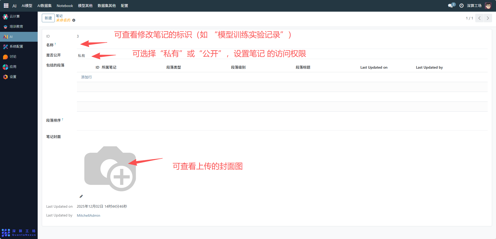
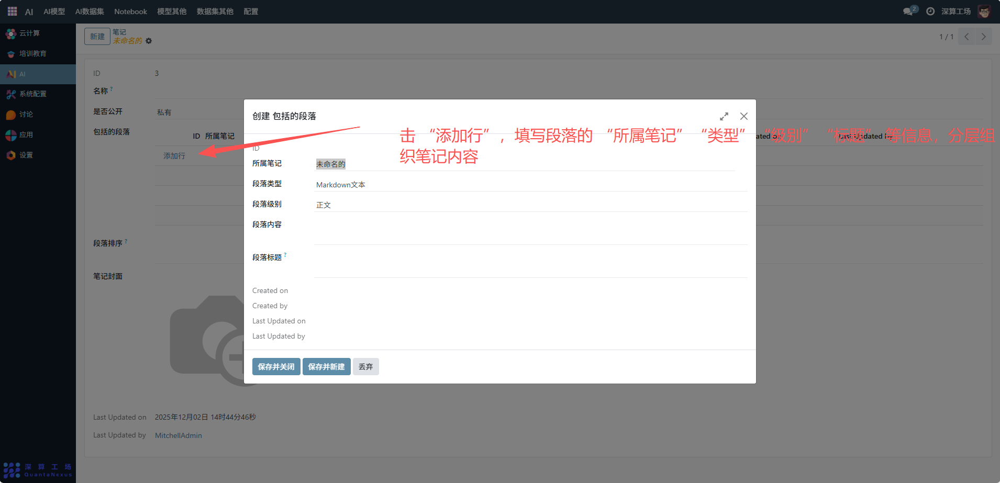
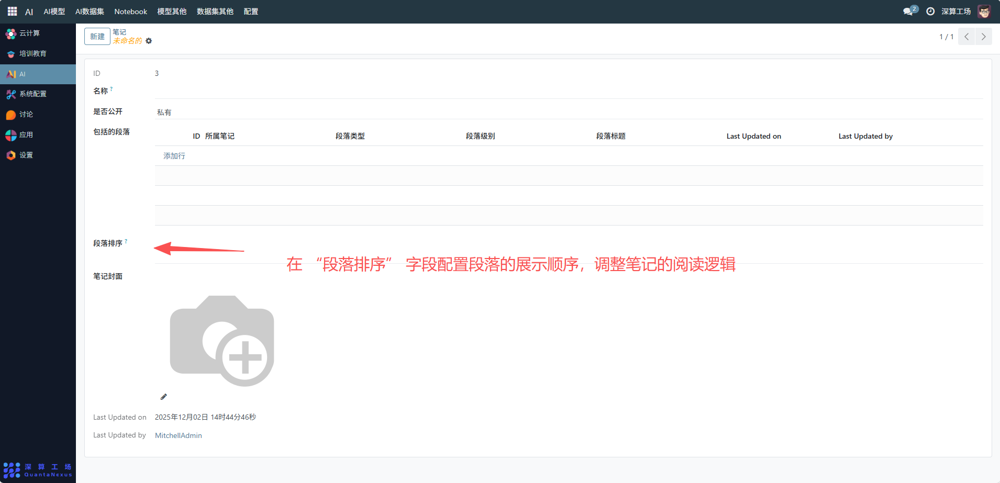
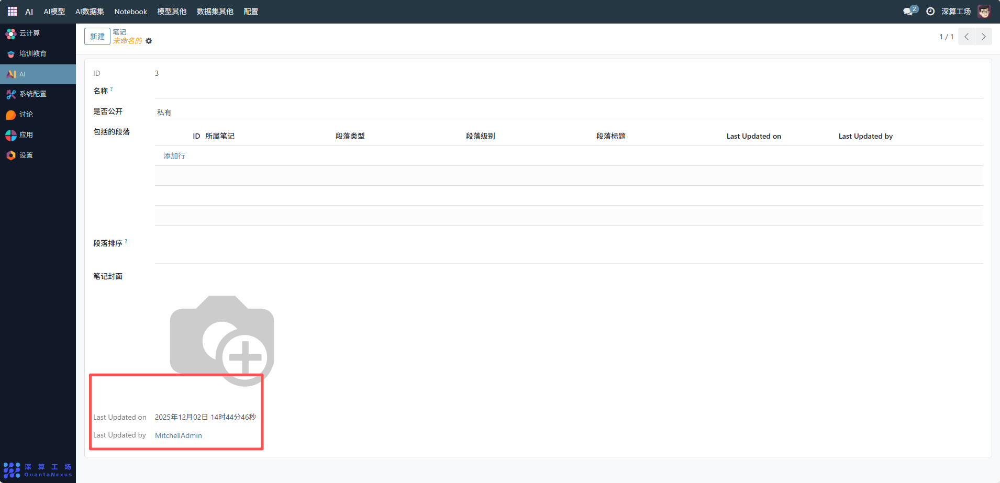

# notebook
这里的 “Notebook（笔记）” 是AI 相关内容的结构化文档管理工具，核心作用是创建、编辑包含多段落的笔记文档（比如模型说明、实验记录），并管控文档的公开性、排版等，是 AI 资源配套文档的集中管理模块。
## 1、笔记基础信息配置
- 名称：可查看修改笔记的标识（如 “模型训练实验记录”）。
- 是否公开：可查看 “私有” 或 “公开”，设置笔记的访问权限。
- 笔记封面：可查看上传的封面图，优化笔记的可视化展示。

## 2、段落内容结构化配置
添加段落：点击 “添加行”，填写段落的 “所属笔记”“类型”“级别”“标题” 等信息，分层组织笔记内容。

段落排序：在 “段落排序” 字段配置段落的展示顺序，调整笔记的阅读逻辑。

## 3、笔记维护
更新记录：笔记内容变更后，可查看 “Last Updated on/by”，跟踪版本更新。

## 4、日常管理与运维
- 创建结构化笔记：按上述流程配置基础信息与段落，完成 AI 相关文档的结构化创作。
- 调整内容与权限：根据需求修改段落内容、排序，或切换笔记的公开状态。
- 跟踪版本历史：通过 “Last Updated” 信息，追溯笔记的更新轨迹。