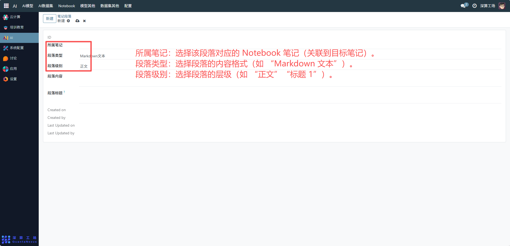
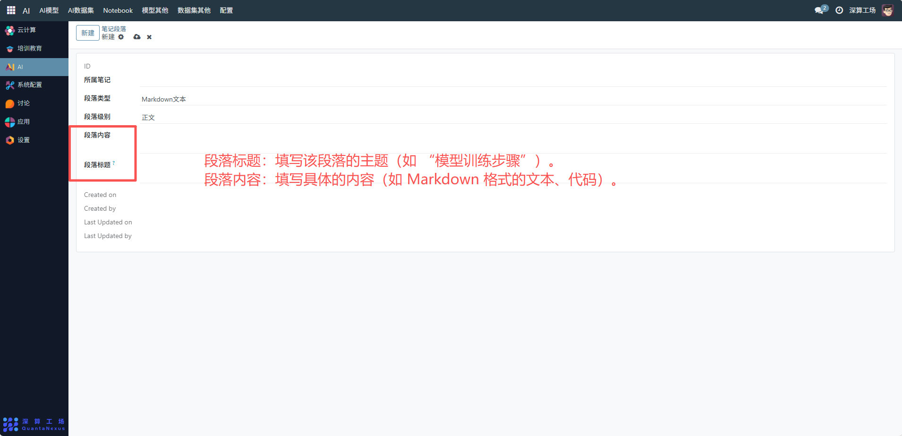
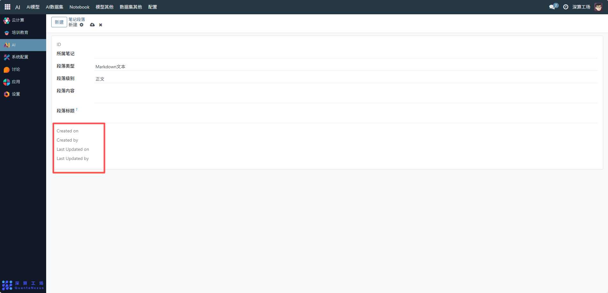

# 笔记段落
“笔记段落” 是Notebook 笔记的结构化内容单元管理工具，核心作用是拆分笔记为独立的段落模块（比如标题、正文、代码块），实现笔记内容的精细化组织与维护，是保障 Notebook 笔记结构化呈现的核心组件。
## 1、段落基础信息配置
- 所属笔记：选择该段落对应的 Notebook 笔记（关联到目标笔记）。
- 段落类型：选择段落的内容格式（如 “Markdown 文本”）。
- 段落级别：选择段落的层级（如 “正文”“标题 1”）。

## 2、段落内容配置
- 段落标题：填写该段落的主题（如 “模型训练步骤”）。
- 段落内容：填写具体的内容（如 Markdown 格式的文本、代码）。

## 3、段落维护
- 跟踪版本：系统自动记录 “Created on/by”“Last Updated on/by”，跟踪段落的修改轨迹。

## 4、日常管理与运维
- 创建段落单元：按上述流程关联笔记、配置属性与内容，完成笔记的结构化拆分。
- 修改段落内容：直接编辑 “段落内容” 字段，更新信息并自动记录版本。
- 调整段落结构：修改 “段落级别”“段落标题”，优化笔记的层级逻辑。