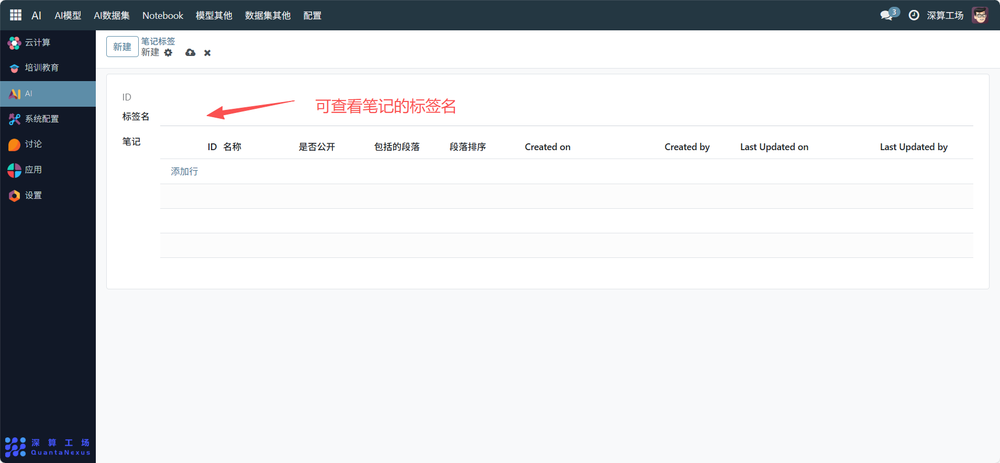
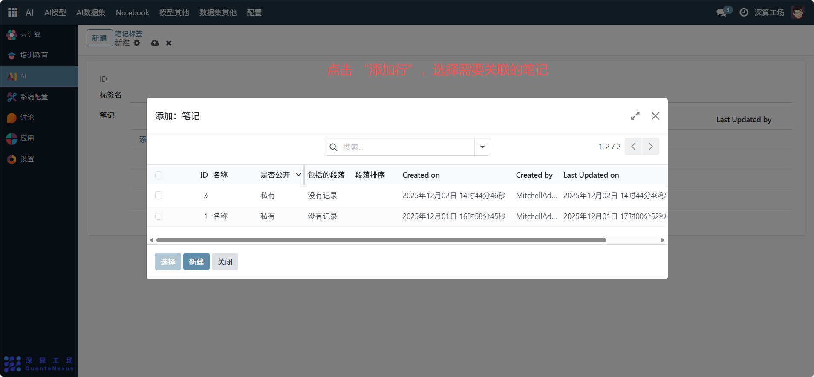

# 笔记标签
“笔记标签” 是Notebook 笔记的分类检索工具，核心作用是给笔记添加统一的标签标识，实现多笔记的归类管理与快速检索，是提升笔记资源管理效率的辅助模块。
## 1、标签基础信息配置
标签名：填写标签的分类标识（如 “AI 模型部署”）。

## 2、关联笔记配置
添加行：点击 “添加行”，选择需要关联的笔记（填写笔记的 ID、名称等信息），将笔记绑定到当前标签下。

## 3、日常管理与运维
- 创建分类标签：按上述流程配置标签名，完成分类维度的定义。
- 关联笔记：通过 “添加行” 将目标笔记绑定到标签下，实现归类。
- 检索笔记：通过标签筛选对应的笔记列表，快速查找同类内容。
- 调整关联关系：新增 / 删除关联的笔记行，更新标签下的笔记范围。