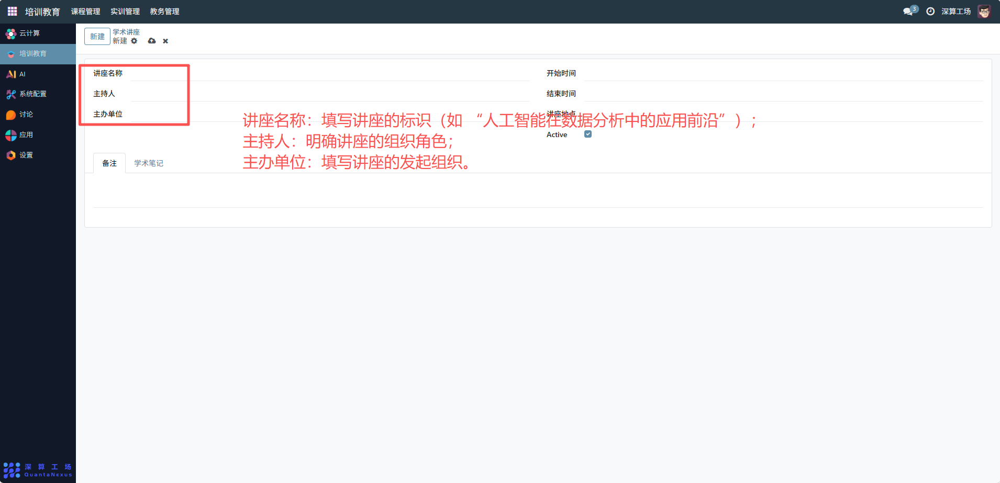
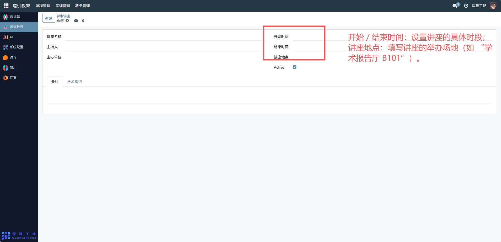
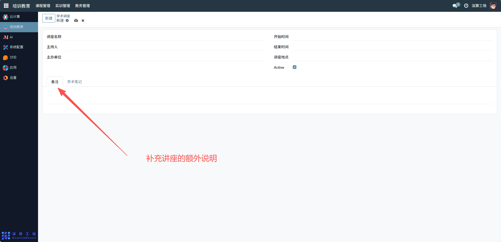

# 学术讲座
“学术讲座” 是学术交流活动的全流程管理工具，核心作用是统筹讲座的基本信息、时间地点与配套记录，实现学术讲座从规划、组织到内容留存的规范化管理，是保障学术交流有序开展的核心模块。
## 1、讲座基础信息配置
- 讲座名称：填写讲座的标识（如 “人工智能在数据分析中的应用前沿”）。
- 主持人：明确讲座的组织角色。
- 主办单位：填写讲座的发起组织。

## 2、讲座时间与场地配置
开始 / 结束时间：设置讲座的具体时段。
讲座地点：填写讲座的举办场地（如 “学术报告厅 B101”）。

## 3、状态与内容配置
Active 开关：开启则该讲座记录生效。

备注：补充讲座的额外说明；

学术笔记：切换到该标签，记录讲座的核心内容、要点，留存学术信息。

## 4、日常管理与运维
- 创建讲座记录：填写基础信息、时间地点，完成讲座的初始化登记。
- 管控讲座状态：通过 “Active” 开关启用 / 停用讲座记录，适配活动安排。
- 留存讲座内容：在 “学术笔记” 中记录讲座要点，实现知识归档。
- 调整讲座信息：若时间、地点变更，修改对应字段同步最新安排。