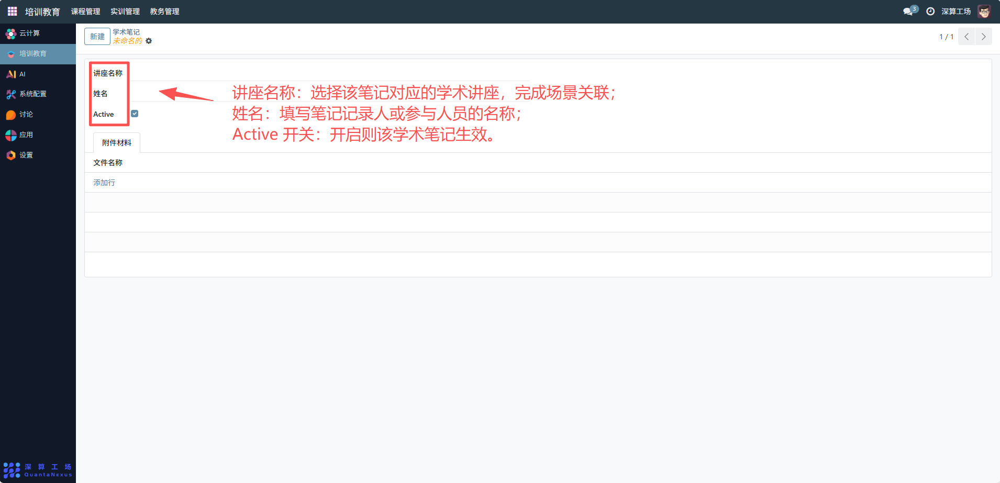
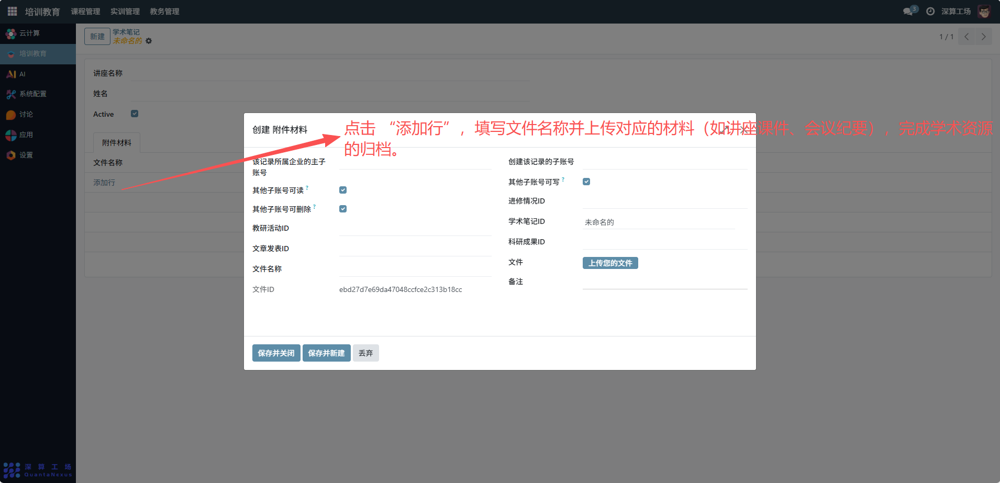

# 学术笔记
“学术笔记” 是学术活动内容与材料的集中管理工具，核心作用是关联对应的学术讲座、记录参与人员，并归档讲座相关的附件材料，实现学术信息与资源的系统化存储，是保障学术知识沉淀与复用的核心模块。
## 1、笔记基础信息配置
- 讲座名称：选择该笔记对应的学术讲座，完成场景关联。
- 姓名：填写笔记记录人或参与人员的名称。
- Active 开关：开启则该学术笔记生效。

## 2、附件材料配置
附件材料（表格）：点击 “添加行”，填写文件名称并上传对应的材料（如讲座课件、会议纪要），完成学术资源的归档。

## 3、日常管理与运维
- 创建笔记关联：填写讲座名称、参与人员，完成笔记的基础信息配置。
- 归档附件材料：上传讲座相关文档，集中管理学术资源。
- 管控笔记状态：通过 “Active” 开关启用 / 停用笔记，适配管理需求。
- 查阅复用资源：后续需要相关学术材料时，直接调取该笔记的附件，支撑研究或教学。