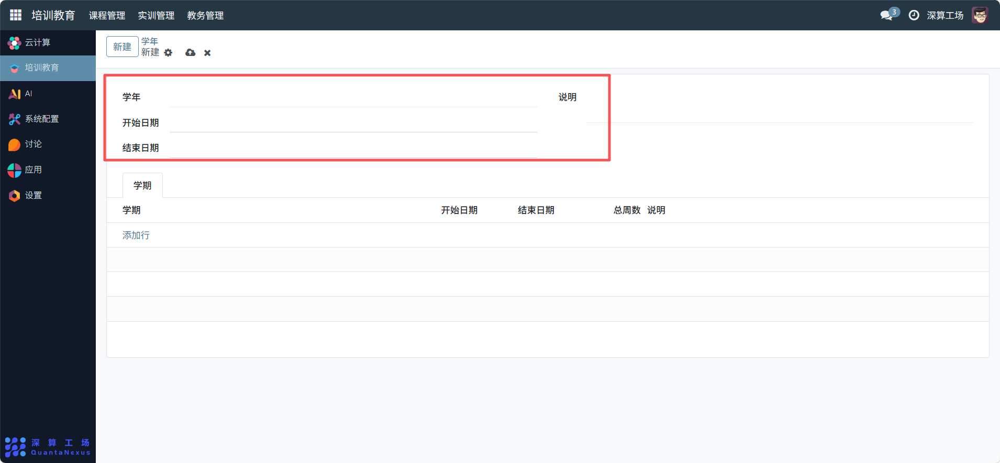
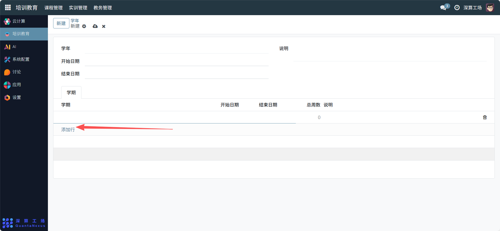

# 学年
“学年” 是教学周期的顶层框架定义工具，核心作用是明确一整个学年的时间范围，并关联该学年下的所有学期，为学期、课程等模块提供统一的年度时间基准，是支撑学年制教学管理的核心基础模块。
## 1、学年基础信息配置
- 学年：填写学年的标识（如 “2025-2026 学年”），清晰区分不同学年；
- 开始日期 / 结束日期：选择该学年的起止时间（通常为一整年，如 “2025 年 9 月 1 日 - 2026 年 8 月 31 日”）。
- 说明：补充学年的额外信息（如 “该学年含寒假调课安排”）。

## 2、学年下的学期关联配置
学期（表格）：点击 “添加行”，填写该学年下包含的学期信息（学期名称、开始 / 结束日期、总周数、说明），完成学年与学期的层级关联。

## 3、日常管理与运维
- 创建学年框架：填写学年名称、起止日期，完成年度教学周期的定义。
- 关联学期信息：将该学年下的所有学期（如秋季学期、春季学期）添加到表格中，梳理年度教学结构。
- 支撑后续模块：后续的 “学期”“开课计划” 等模块会关联该学年信息，作为时间基准。
- 更新学年配置：若学年时间或学期结构调整，修改对应字段同步最新内容。