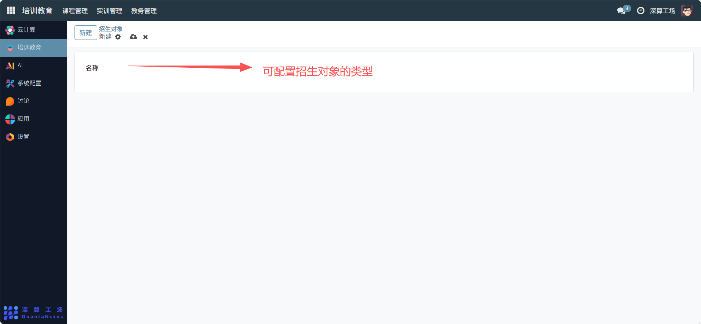

# 招生对象
招生对象” 是教育/ 专业招生范围的标准化定义工具，核心作用是明确某个项目（如专业、培训）的招生群体类型（如 “高中毕业生”“在职人员”），实现招生范围的统一标识与管理，是保障招生工作精准定位目标群体的基础模块。
## 1、招生对象名称配置
名称：在输入框中填写招生对象的类型（如 “高中应届毕业生”“互联网行业从业者”），清晰区分不同目标群体。

## 2、日常管理与运维
- 创建招生对象：在输入框填写对应的群体名称，完成该类型招生对象的定义；
- 关联招生项目：在专业、培训项目的配置中，选择对应的招生对象，明确项目的目标群体；
- 管理招生类型：根据招生需求新增 / 调整招生对象名称，保持招生范围的精准性。