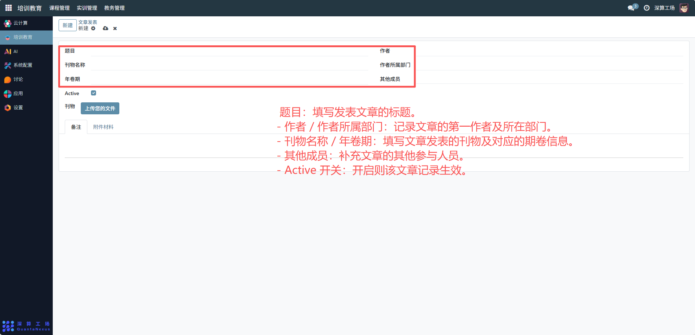
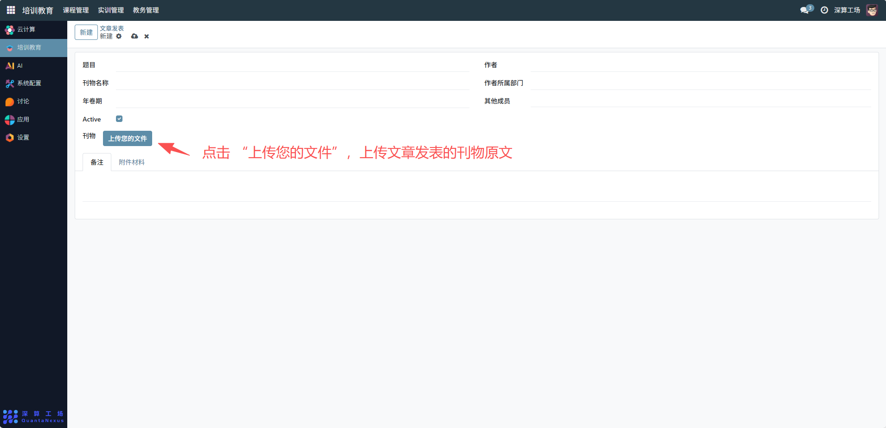
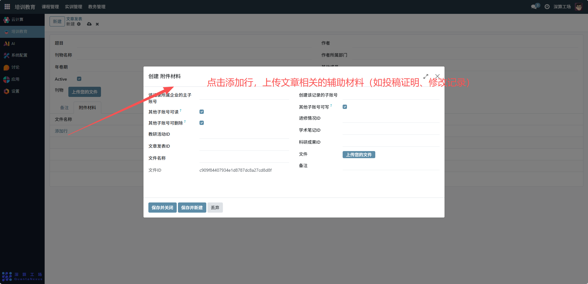

# 文章发表
“文章发表” 是学术文章发表信息的全流程管理工具，核心作用是记录文章的基本信息（题目、刊物、作者等），并归档发表相关的材料，实现学术成果的系统化登记与资源存储，是保障科研成果管理的核心模块。
## 1、文章基础信息配置
- 题目：填写发表文章的标题。
- 作者 / 作者所属部门：记录文章的第一作者及所在部门。
- 刊物名称 / 年卷期：填写文章发表的刊物及对应的期卷信息。
- 其他成员：补充文章的其他参与人员。
- Active 开关：开启则该文章记录生效。

## 2、材料归档配置
- 刊物：点击 “上传您的文件”，上传文章发表的刊物原文；

- 附件材料：切换到该标签，上传文章相关的辅助材料（如投稿证明、修改记录）。

## 3、日常管理与运维
- 登记文章信息：填写题目、刊物、作者等内容，完成学术成果的基础登记。
- 归档发表材料：上传刊物原文与附件，集中管理成果资源。
- 管控成果状态：通过 “Active” 开关启用 / 停用文章记录，适配管理需求。
- 查阅成果信息：后续需要统计或使用成果时，直接调取该记录的信息与材料。