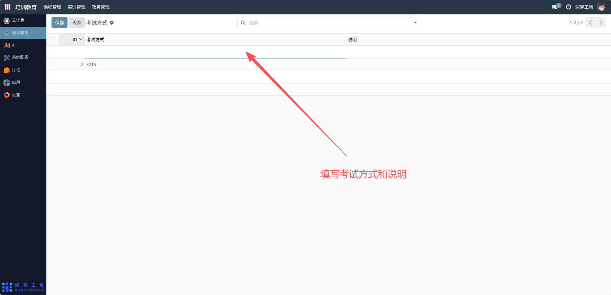

# 考核方式
“考核方式” 是课程成绩评定形式的标准化管理工具，核心作用是定义课程的考核类型（如 “笔试”“项目答辩”“平时作业”），统一成绩评定的形式标准，为课程考核的规范化执行提供依据。
## 1、考核方式信息配置
- ID：系统自动生成的方式唯一标识（无需手动填写）。
- 考试方式：填写考核形式的名称（如 “笔试”“项目答辩”“综合作业”）。
- 说明：补充该考核方式的规则（如 “项目答辩：以小组项目展示 + 问答的形式评定成绩”）。

## 2、日常管理与运维
- 新增考核方式：点击空白行，填写 “考试方式” 与 “说明”，完成新考核形式的创建。
- 关联课程：在 “课程设置” 模块中，为课程选择对应的考核方式，明确其成绩评定形式。
- 筛选课程考核：通过搜索框输入考核方式名称，快速找到采用同类评定形式的课程。
- 优化考核体系：根据教学需求新增 / 调整考核方式（如新增 “虚拟仿真操作考核”），同步课程关联。