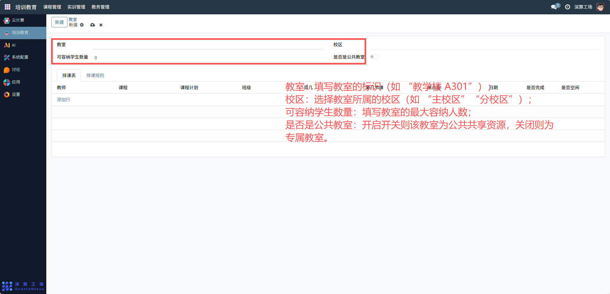
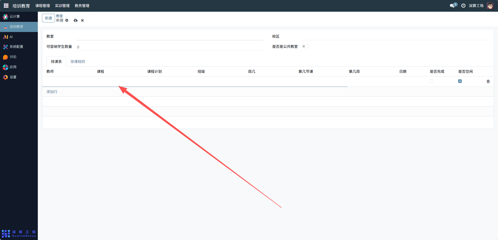
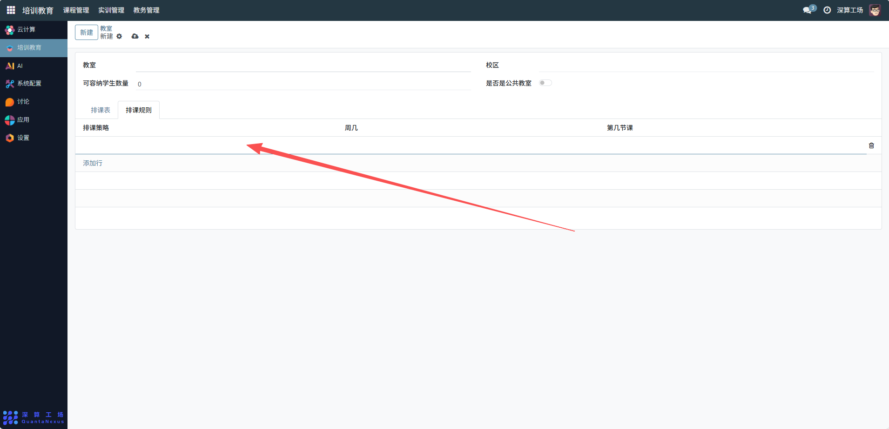

# 教室
“教室” 是教学场地的全流程管理工具，核心作用是记录教室的基础信息（容量、校区），并跟踪其排课安排与空闲状态，实现教室资源的合理分配与使用监控，是保障教学场地有序调度的核心模块。
## 1、教室基础信息配置
- 教室：填写教室的标识（如 “教学楼 A301”）。
- 校区：选择教室所属的校区（如 “主校区”“分校区”）。
- 可容纳学生数量：填写教室的最大容纳人数。
- 是否是公共教室：开启开关则该教室为公共共享资源，关闭则为专属教室。

## 2、排课与状态配置
- 排课表（表格）：点击 “添加行”，填写该教室的排课信息（教师、课程、班级、周几、第几节课等）。
- 状态字段：更新 “是否完成”“是否空闲”，同步教室的使用状态。

## 3、排课规则配置
- 排课规则：切换到该标签，定义该教室的排课限制（如允许排课的课程类型、时段）。

## 4、日常管理与运维
- 创建教室信息：填写基础信息，完成教室的初始化定义。
- 配置排课安排：添加排课表信息，明确教室的使用计划。
- 监控场地状态：通过 “是否空闲” 跟踪教室的实时使用情况，避免冲突；
- 调整教室配置：若场地用途变更，修改 “是否公共教室” 或排课规则，同步资源属性。