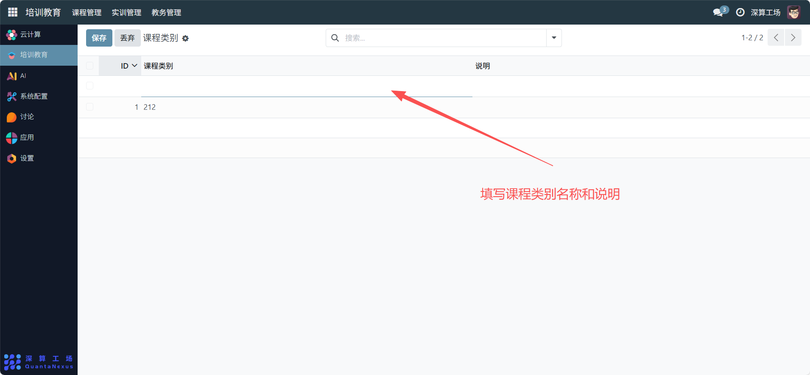

# 课程类别
“课程类别” 是课程的分类管理工具，核心作用是给课程定义统一的类别标签（如 “专业必修课”“公共选修课”），实现课程的结构化分类与快速检索，是提升课程管理效率的基础模块。
## 1、课程类别信息配置
- ID：系统自动生成的类别唯一标识（无需手动填写）；
- 课程类别：填写类别的名称（如 “专业必修课”“公共选修课”），清晰区分不同课程类型；
- 说明：补充该类别的定义（如 “专业必修课：专业人才培养的核心课程”）。

## 2、日常管理与运维
- 新增课程类别：点击空白行，填写 “课程类别” 与 “说明”，完成新分类的创建；
- 关联课程：在 “课程设置” 模块中，为课程选择对应的类别标签，完成课程与类别的绑定；
- 检索课程资源：通过搜索框输入类别名称，快速筛选同类课程；
- 优化类别体系：若分类维度调整，新增 / 删除类别，同步更新课程的类别关联。