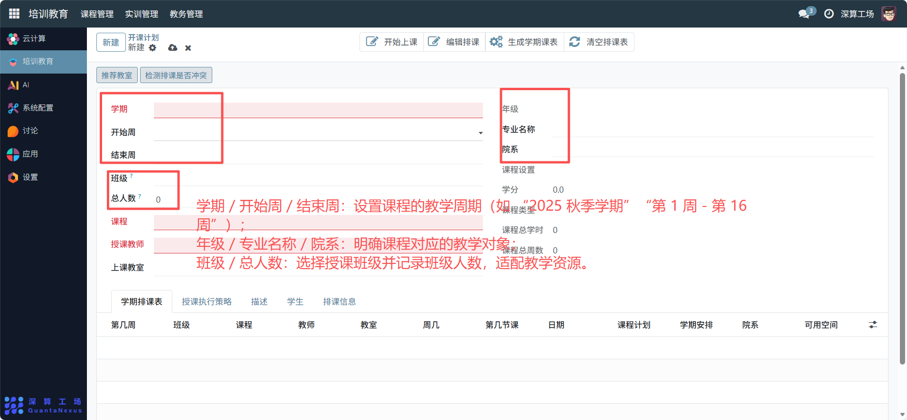
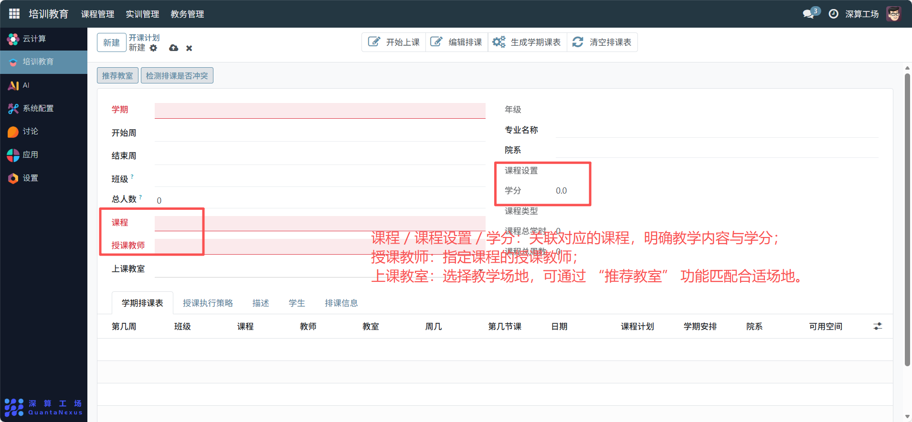
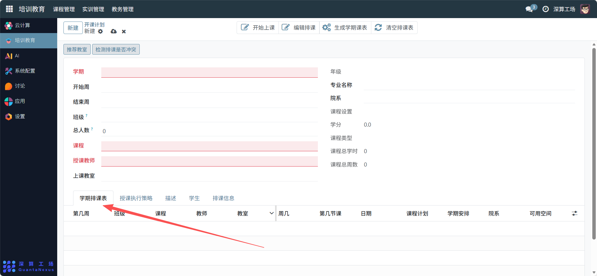
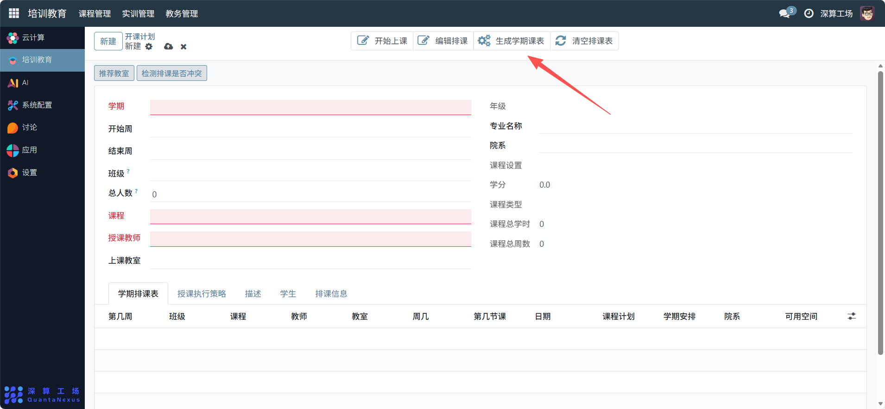
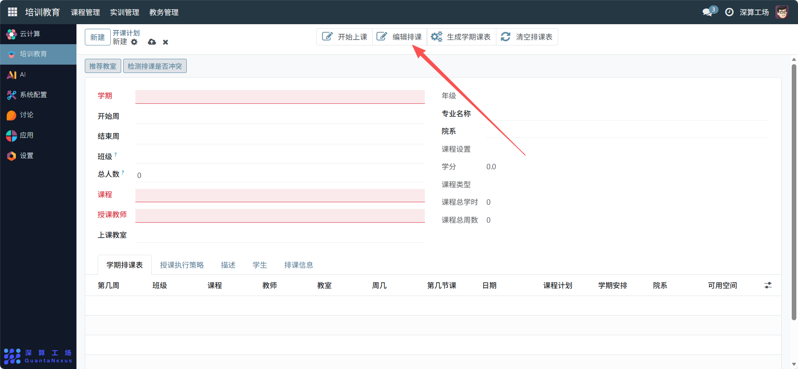

# 开课计划
“开课计划” 是课程教学的学期排课与资源统筹工具，核心作用是集中配置学期课程的教学安排（时间、班级、师资、教室），自动检测排课冲突、生成课表，实现课程从规划到执行的全流程管控，是保障学期教学有序开展的核心排课模块。
## 1、基础教学信息配置
- 学期 / 开始周 / 结束周：设置课程的教学周期（如 “2025 秋季学期”“第 1 周 - 第 16 周”）。
- 年级 / 专业名称 / 院系：明确课程对应的教学对象。
- 班级 / 总人数：选择授课班级并记录班级人数，适配教学资源。

## 2、课程与资源配置
- 课程 / 课程设置 / 学分：关联对应的课程，明确教学内容与学分。
- 上课教室：选择教学场地，可通过 “推荐教室” 功能匹配合适场地。

## 3、排课与课表生成
学期排课表（表格）：点击添加行，填写 “第几周、班级、课程、教师、教室、周几、第几节课” 等排课细节。

检测排课是否冲突：点击该按钮，自动校验师资、教室的时间冲突。

生成学期课表：确认排课信息后，点击生成结构化课表。

编辑排课 / 清空排课表：按需调整或重置排课信息。

