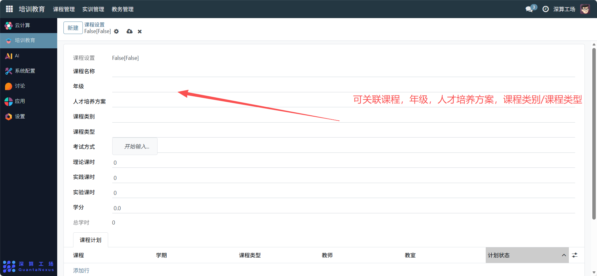
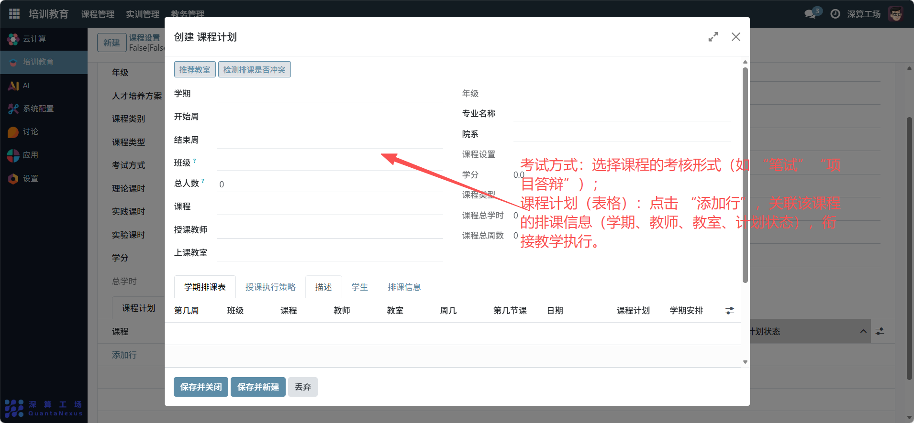

# 课程设置
“课程设置” 是单门课程的精细化信息配置工具，核心作用是定义课程的基础属性、课时结构、考核方式，并关联对应的培养方案与排课计划，实现单门课程从信息定义到教学执行的全流程规范，是支撑课程教学落地的核心基础模块。
## 1、课程基础属性配置
- 课程名称：填写课程的标识（如 “Python 数据分析基础”）；
- 年级：选择课程对应的教学年级（如 “2025 级”）；
- 人才培养方案：关联该课程所属的人才培养方案，明确课程的培养定位；
- 课程类别 / 课程类型：选择课程的分类（如 “专业必修课”“实践课”）。

## 2、课程课时与学分配置
- 理论课时 / 实践课时 / 实验课时：填写对应类型的课时数量；
- 学分：设置课程对应的学分（如 “3.0”）；
- 总学时：系统自动汇总理论 + 实践 + 实验课时（无需手动填写）。

## 3、课程考核与执行配置
- 考试方式：选择课程的考核形式（如 “笔试”“项目答辩”）；
- 课程计划（表格）：点击 “添加行”，关联该课程的排课信息（学期、教师、教室、计划状态），衔接教学执行。

## 4、日常管理与运维
- 定义课程信息：填写课程名称、年级、培养方案等基础属性，完成课程的初始化；
- 配置课时与学分：拆分理论 / 实践课时，设置学分，明确课程的教学结构；
- 关联课程计划：添加排课信息，为课程的实际教学提供执行依据；
- 更新课程配置：若课程内容、课时调整，修改对应字段同步最新教学信息。