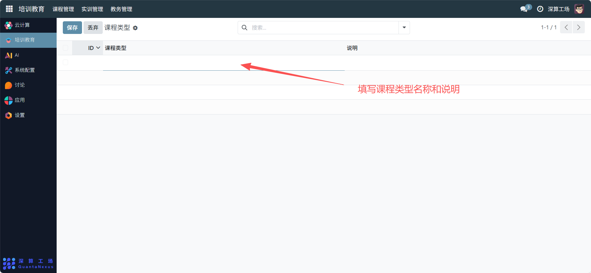

# 课程类型
“课程类型” 是课程教学形式的分类管理工具，核心作用是定义课程的教学形态（如 “理论课”“实践课”“实验课”），实现课程按教学形式的分类管理，为教学资源调配、课时统计提供精准的类型依据。
## 1、课程类型信息配置
- ID：系统自动生成的类型唯一标识（无需手动填写）。
- 课程类型：填写类型名称（如 “理论课”“实践课”“混合式教学课”）。
- 说明：补充该类型的定义（如 “实践课：以动手操作、项目训练为主的课程”）。

## 2、日常管理与运维
- 新增课程类型：点击空白行，填写 “课程类型” 与 “说明”，完成新类型的创建。
- 关联课程：在 “课程设置” 模块中，为课程选择对应的类型标签，明确其教学形式。
- 筛选课程资源：通过搜索框输入类型名称，快速找到同类教学形式的课程。
- 优化类型体系：根据教学模式更新（如新增 “虚拟仿真课”），调整类型列表并同步课程关联。