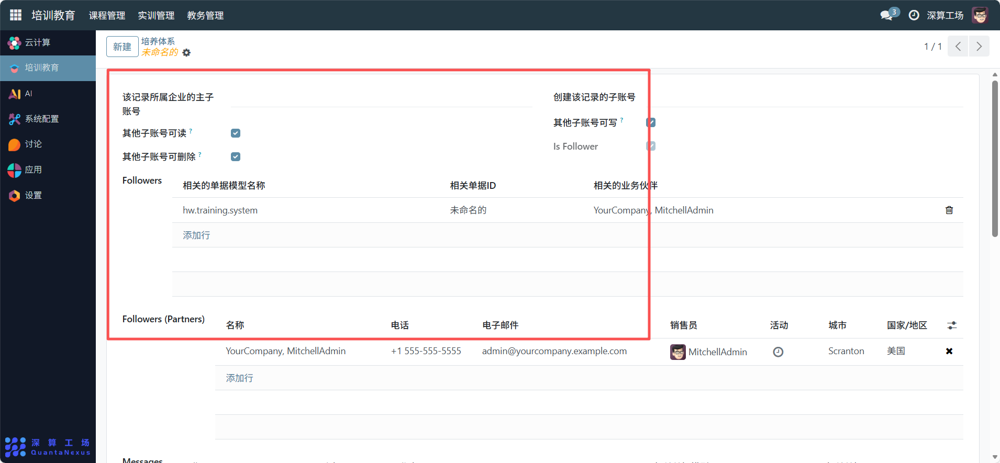
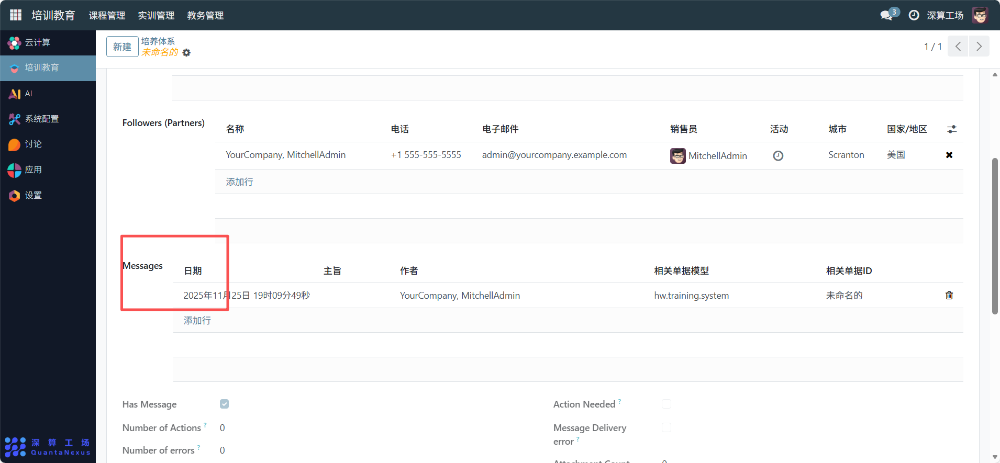
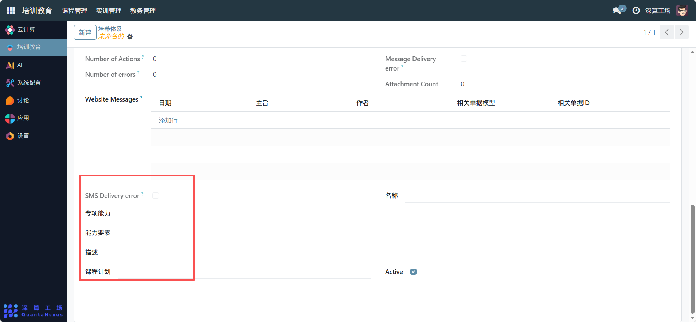

# 培养体系
“培养体系” 是人才培养的全流程管理工具，核心作用是整合培养相关的权限、协作、沟通、能力标准等信息，搭建从培养目标到执行落地的完整管理框架，实现培养过程的权限管控、协作跟踪与信息同步，是保障培养工作系统化开展的核心模块。
## 1、权限与协作配置
- 账号权限：设置 “其他子账号可读 / 可写 / 可删除” 开关，定义不同账号的操作权限。
- Followers（协作伙伴）：点击 “添加行”，填写相关单据、业务伙伴信息，明确协作对象。
- Followers (Partners)：添加合作方的名称、电话等信息，管理外部协作资源。

## 2、沟通与消息配置
- Messages：点击 “添加行”，记录培养过程中的消息（日期、主旨、作者），关联对应的业务单据。
- 消息状态：通过 “Has Message”“Action Needed” 标记消息是否需要跟进，跟踪沟通进度。

## 3、能力与执行配置
- 专项能力 / 能力要素：填写培养体系对应的核心能力要求（如 “数据分析能力”“数据可视化技能”）。
- 描述：补充培养体系的整体说明。
- 课程计划：关联对应的教学排课计划，衔接培养的执行环节。
- Active 开关：开启则该培养体系处于生效状态。

## 4、日常管理与运维
- 搭建体系框架：配置账号权限、协作伙伴，确定培养体系的参与角色。
- 定义能力标准：填写专项能力、能力要素，明确培养目标。
- 跟踪沟通与执行：记录消息、关联课程计划，保障培养过程的信息同步与落地。
- 更新体系内容：根据培养效果调整能力要求、协作对象等，优化培养体系。