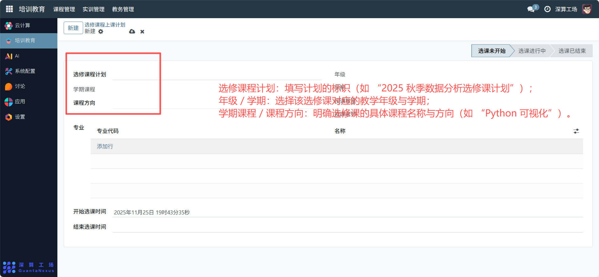
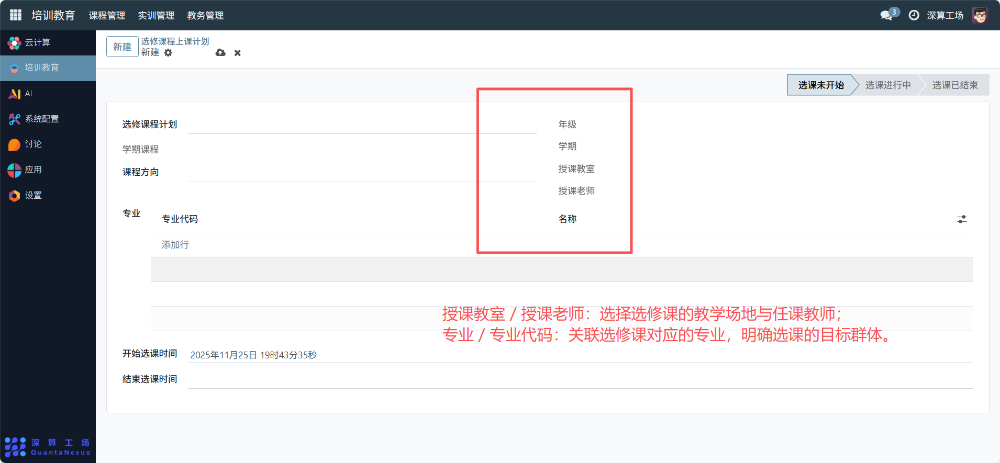
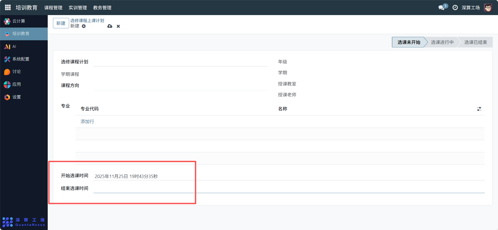

# 选修课
“选修课程上课计划” 是选修课程的排课与选课管理工具，核心作用是明确选修课程的教学安排（年级、学期、师资等），定义选课的时间范围，实现选修课程从排课规划到选课执行的全流程管控，是保障选修课有序开展的核心模块。
## 1、课程基础信息配置
- 选修课程计划：填写计划的标识（如 “2025 秋季数据分析选修课计划”）。
- 年级 / 学期：选择该选修课对应的教学年级与学期。
- 学期课程 / 课程方向：明确选修课的具体课程名称与方向（如 “Python 可视化”）。

## 2、教学资源配置
- 授课教室 / 授课老师：选择选修课的教学场地与任课教师。
- 专业 / 专业代码：关联选修课对应的专业，明确选课的目标群体。

## 3、选课时间与状态配置
- 开始选课时间 / 结束选课时间：设置选课的起止时间（如 “2025-11-25 19:41” 至 “2025-12-01 23:59”）。
- 选课状态标签：根据时间自动或手动切换 “选课未开始 / 进行中 / 已结束”，同步选课阶段。

## 4、日常管理与运维
- 搭建选修课框架：填写课程、年级、专业等信息，确定选修课的基本配置。
- 配置教学资源：关联教室、老师，保障教学的硬件与师资。
- 设置选课时间：定义选课周期，开启选课流程。
- 跟踪选课状态：根据时间更新选课标签，同步学生的选课进度。