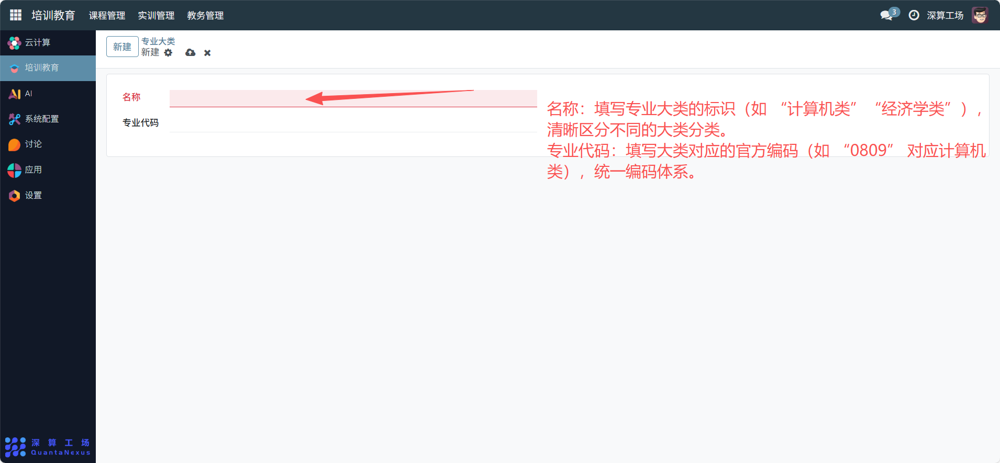

# 专业大类
“专业大类” 是专业分类的顶层框架工具，核心作用是对多个细分专业进行归类（如将 “数据科学”“计算机科学” 归为 “计算机类”），实现专业的层级化分类管理，为后续教学资源的统筹分配提供统一的大类维度。
## 1、专业大类基础信息配置
- 名称：填写专业大类的标识（如 “计算机类”“经济学类”），清晰区分不同的大类分类。
- 专业代码：填写大类对应的官方编码（如 “0809” 对应计算机类），统一编码体系。

## 2、日常管理与运维
- 创建专业大类：填写名称与专业代码，完成某个大类的定义。
- 关联细分专业：在 “专业” 模块中，将对应的细分专业关联到该大类下，搭建 “大类 - 专业” 的层级结构。
- 统筹教学资源：按专业大类配置通用课程、实训资源，提升资源复用率。
- 优化分类体系：根据专业调整新增 / 合并大类，保持分类的合理性。