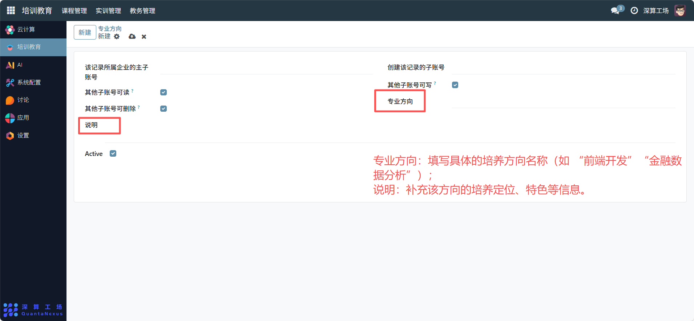
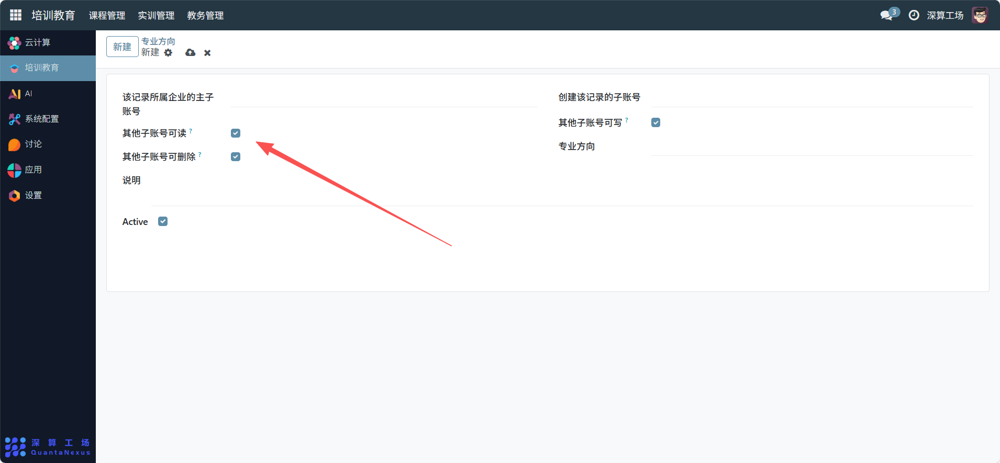

# 专业方向
“专业方向” 是细分专业培养侧重点的管理工具，核心作用是在专业（或小类）下定义更具体的培养方向（如 “计算机专业” 下的 “前端开发方向”“后端架构方向”），同时管控该方向的账号操作权限，实现专业培养的个性化与权限规范化，是保障专业细分培养落地的工具。
## 1、专业方向基础信息配置
- 专业方向：填写具体的培养方向名称（如 “前端开发”“金融数据分析”）。
- 说明：补充该方向的培养定位、特色等信息。

## 2、权限与生效状态配置
- 账号权限：勾选 “其他子账号可读 / 可写 / 可删除” 开关，定义不同账号的操作权限。
- Active 开关：开启则该专业方向生效，可关联到对应专业与学生。

## 3、日常管理与运维
- 创建专业方向：填写方向名称与说明，完成个性化培养方向的定义。
- 配置操作权限：根据角色需求设置账号的读写删除权限，保障数据安全。
- 关联专业与学生：将该方向关联到对应专业，供学生选择培养侧重点。
- 调整生效状态：通过 “Active” 开关启用 / 停用该方向，适配培养需求变化。