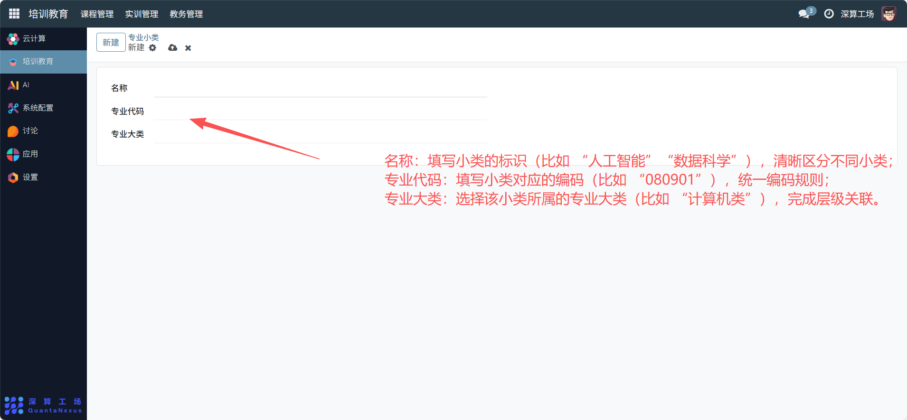

# 专业小类
“专业小类” 是专业分类的精细化层级工具，核心作用是在 “专业大类” 之下进一步细分专业类别（比如在 “计算机类” 大类下拆分出 “人工智能”“数据科学” 等小类），实现专业分类的多层级精准管理，为教学资源的精准匹配提供更细的维度。
## 1、专业小类基础信息配置
- 名称：填写小类的标识（比如 “人工智能”“数据科学”），清晰区分不同小类。
- 专业代码：填写小类对应的编码（比如 “080901”），统一编码规则。
- 专业大类：选择该小类所属的专业大类（比如 “计算机类”），完成层级关联。

## 2、日常管理与运维
- 创建专业小类：填写名称、代码，并关联对应的专业大类，完成小类定义。
- 关联细分专业：在 “专业” 模块中，将具体专业关联到对应小类下，搭建 “大类 - 小类 - 专业” 的层级结构。
- 配置专属资源：按小类分配特色课程、实训项目，提升培养精准度。
- 优化分类维度：根据专业发展新增 / 调整小类，保持分类的合理性。