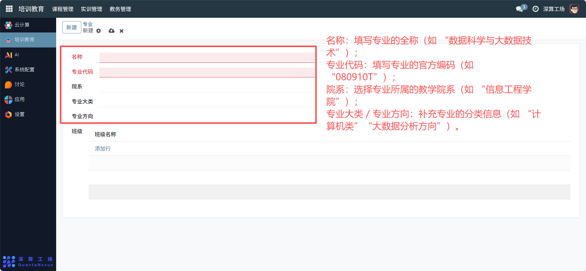
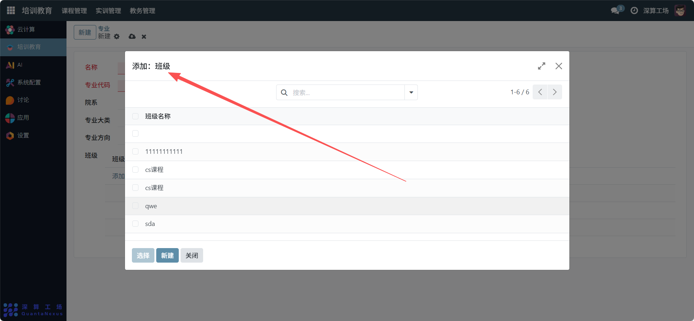

# 专业
“专业” 是教学组织的基础分类工具，核心作用是定义专业的基本信息（名称、代码、所属院系等），并关联对应的班级，搭建专业 - 班级的层级教学结构，是支撑课程、实训、排课等模块的核心基础组织单元。
## 1、专业基础信息配置
- 名称：填写专业的全称（如 “数据科学与大数据技术”）。
- 专业代码：填写专业的官方编码（如 “080910T”）。
- 院系：选择专业所属的教学院系（如 “信息工程学院”）。
- 专业大类 / 专业方向：补充专业的分类信息（如 “计算机类”“大数据分析方向”）。

## 2、专业与班级的关联配置
班级（表格）：点击 “添加行”，填写该专业下的班级名称（如 “2025 级数据科学 1 班”），完成专业与班级的层级绑定。

## 3、日常管理与运维
- 创建专业信息：填写名称、代码、院系等基础属性，完成专业的初始化。
- 关联班级信息：添加该专业下的所有班级，搭建 “专业 - 班级” 的组织架构。
- 支撑教学模块：后续课程、实训等模块关联该专业，实现教学资源的精准分配。
- 更新专业配置：若专业分类、班级调整，修改对应字段同步最新信息。