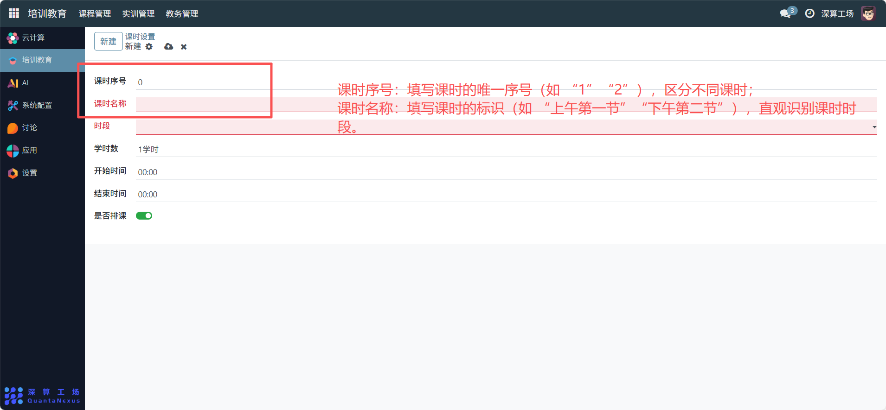
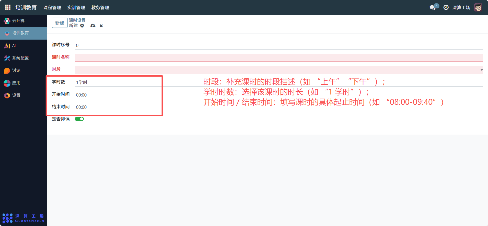
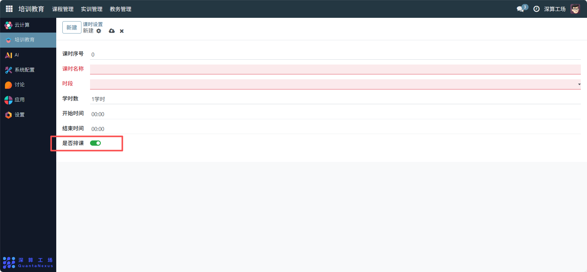

# 课时设置
“课时设置” 是教学时间单元的标准化定义工具，核心作用是明确单个课时的时间范围、时长与排课权限，为排课模块提供统一的课时时间基准，是保障课程时间安排规范、合理的核心基础模块。
## 1、课时基础标识配置
- 课时序号：填写课时的唯一序号（如 “1”“2”），区分不同课时。
- 课时名称：填写课时的标识（如 “上午第一节”“下午第二节”），直观识别课时时段。

## 2、课时时间与时长配置
- 时段：补充课时的时段描述（如 “上午”“下午”）。
- 学时时数：选择该课时的时长（如 “1 学时”。
- 开始时间 / 结束时间：填写课时的具体起止时间（如 “08:00-09:40”）。

## 3、课时排课权限配置
是否排课：点击开关（绿色为开启），设置该课时是否允许安排课程（开启则可排课，关闭则不可排课）。

