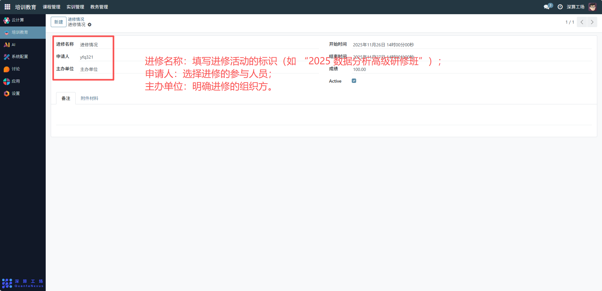
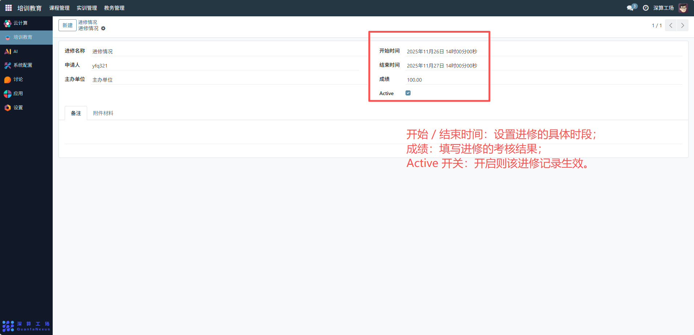
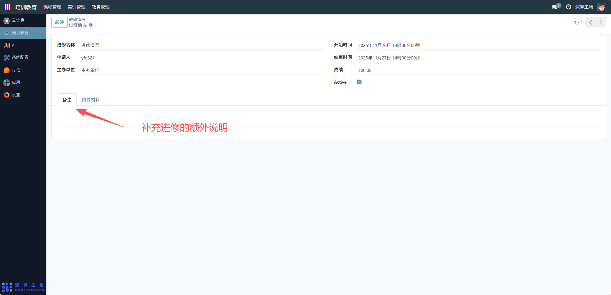
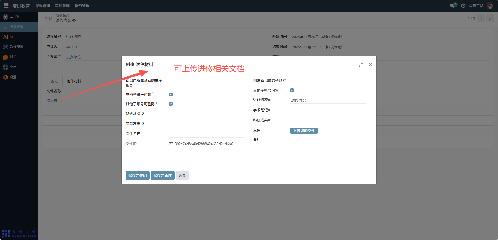

# 进修情况
“进修情况” 是人员进修学习的全流程管理工具，核心作用是记录进修的基本信息、参与人员、时间与成果，实现进修活动从申请、执行到结果的规范化跟踪，是保障进修管理有序的核心模块。
## 1、进修基础信息配置
- 进修名称：填写进修活动的标识（如 “2025 数据分析高级研修班”）。
- 申请人：选择进修的参与人员。
- 主办单位：明确进修的组织方。

## 2、进修时间与状态配置
- 开始 / 结束时间：设置进修的具体时段。
- 成绩：填写进修的考核结果。
- Active 开关：开启则该进修记录生效。

## 3、材料与备注配置
备注：补充进修的额外说明。

附件材料：切换到该标签，上传进修相关文档（如学习报告、证书）。

## 4、日常管理与运维
- 创建进修记录：填写基础信息、时间等内容，完成进修的初始化登记。
- 跟踪进修结果：更新成绩字段，记录进修的考核情况。
- 归档进修材料：上传附件，集中管理进修相关文档。
- 调整进修状态：通过 “Active” 开关启用 / 停用进修记录，适配管理需求。