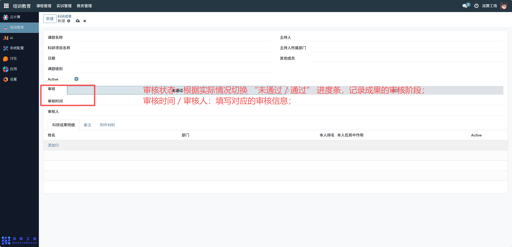
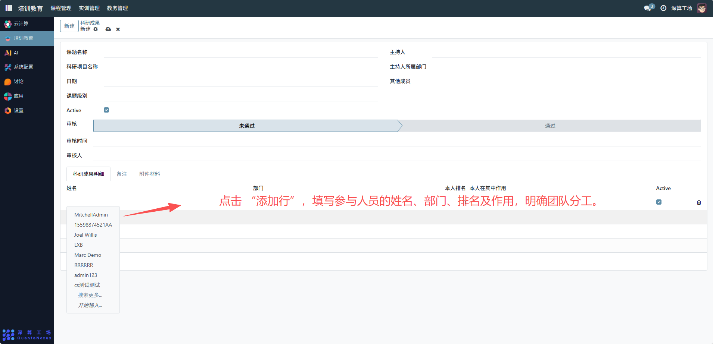
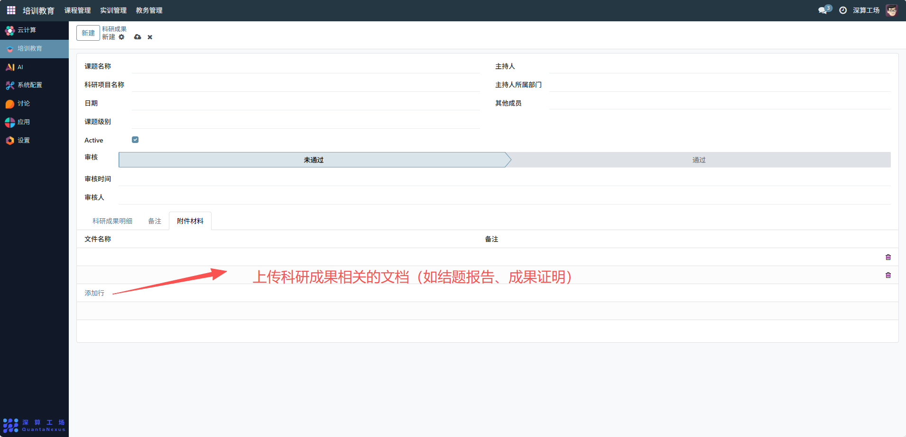

# 科研成果
“科研成果” 是科研项目与成果的全流程管理工具，核心作用是记录科研课题的基本信息、参与人员、审核状态，并归档成果材料，实现科研成果从申报、审核到登记的规范化管理，是保障科研工作有序跟踪的核心模块。
## 1、课题基础信息配置
- 课题名称 / 科研项目名称：可查看填写科研成果对应的课题，项目名称
- 主持人 / 主持人所属部门：可查看关联明确成果的主导人员及部门。
- 日期 / 课题级别：可查看关联填写成果的完成日期与课题的级别，如（校级或者省级）。
- Active 开关：开启则科研成果立即生效。

## 2、审核与人员配置
- 审核状态：可查看根据实际情况切换 “未通过 / 通过” 进度条，记录成果的审核阶段。
- 审核时间 / 审核人：可查看填写对应的审核信息。

科研成果明细（表格）：点击 “添加行”，填写参与人员的姓名、部门、排名及作用，明确团队分工。

## 3、材料归档配置
附件材料：切换到该标签，上传科研成果相关的文档（如结题报告、成果证明）。

## 4、日常管理与运维
- 登记课题信息：可查看基础信息、参与人员，完成科研成果的初始化记录。
- 跟踪审核状态：可更新审核进度条与审核信息，同步成果的审批情况。
- 归档成果材料：上传附件，集中管理科研相关文档。
- 查阅成果信息：后续统计或使用科研成果时，直接调取该记录的信息与材料。