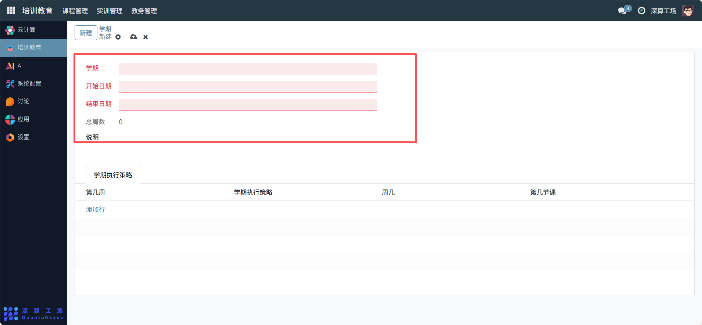
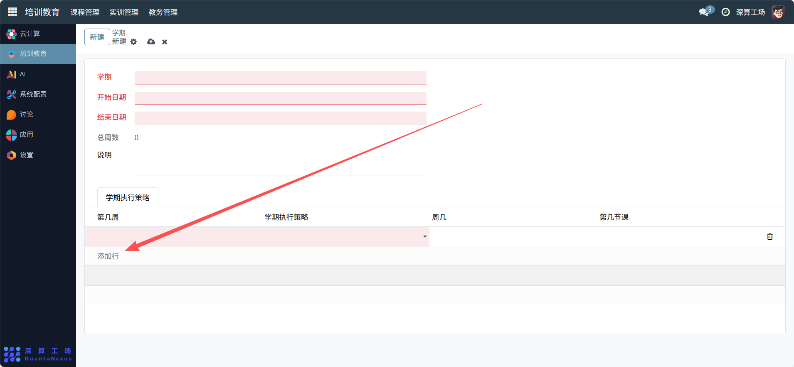

# 学期设置
“学期设置” 是教学周期的基础定义工具，核心作用是明确单个学期的时间范围、教学周数，并配置对应的执行策略，为课程排课、教学计划等模块提供统一的时间基准，是支撑学期制教学管理的核心基础模块。
## 1、学期基础信息配置
- 学期：填写学期的标识（如 “2025-2026 学年秋季学期”），清晰区分不同学期。
- 开始日期 / 结束日期：选择学期的起止时间，确定教学周期。
- 总周数：系统自动根据起止日期计算周数（无需手动填写）。
- 说明：补充学期的额外信息（如 “该学期含国庆假期调课”）。

## 2、学期执行策略配置
学期执行策略（表格）：点击 “添加行”，填写 “第几周、学期执行策略、周几、第几节课”，定义该学期内特定周 / 时间的教学规则（如 “第 8 周 周三 第 3 节课 安排实训”）。

## 3、日常管理与运维
- 创建学期信息：填写学期名称、起止日期，完成学期的基础定义。
- 配置执行策略：根据教学需求，添加学期内的特殊教学安排规则。
- 关联教学模块：将该学期信息关联到 “开课计划”“课表” 等模块，作为时间基准。