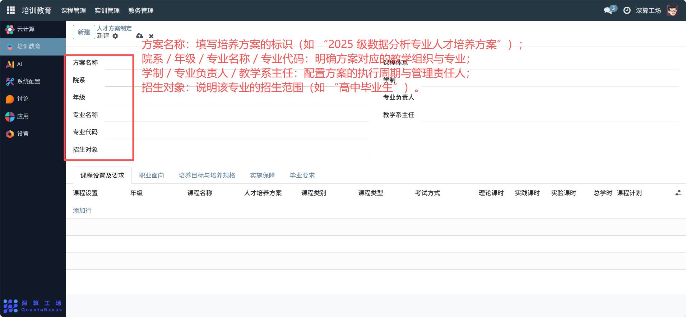
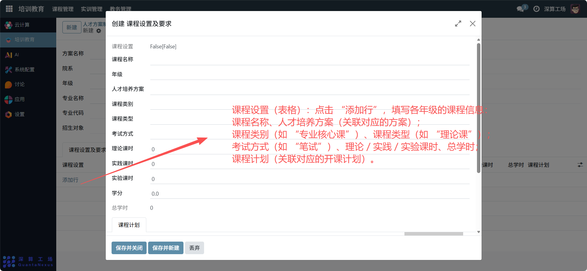
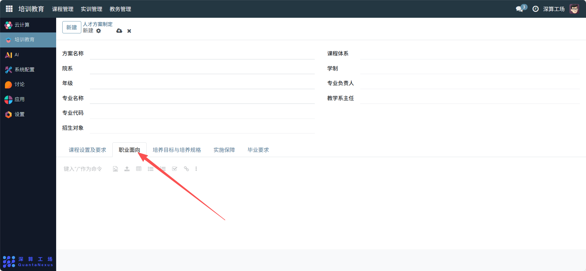
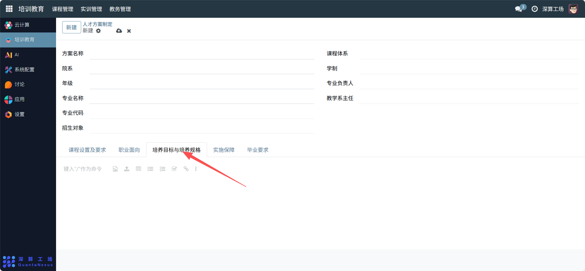
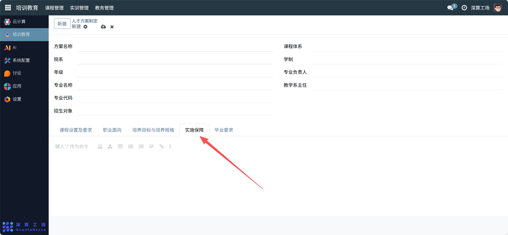
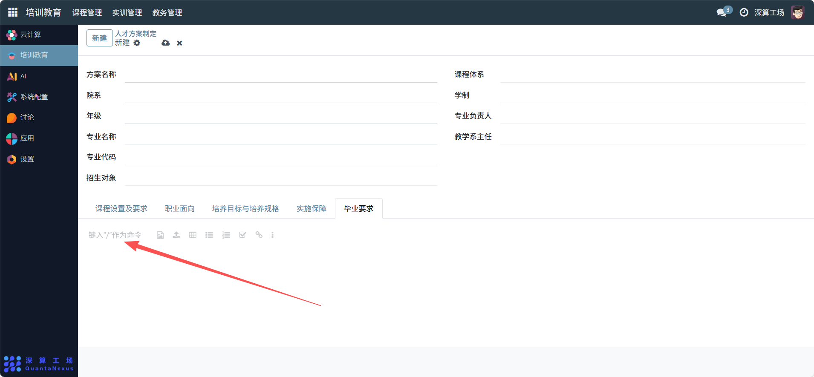

# 人才方案制定
“人才方案制定” 是专业人才培养的顶层设计工具，核心作用是围绕特定专业明确培养目标、规划课程体系、定义毕业要求等，形成完整的人才培养方案，为专业教学、课程设置提供统一的指导框架，是保障人才培养质量的核心规划模块。
## 1、基础信息配置
- 方案名称：填写培养方案的标识（如 “2025 级数据分析专业人才培养方案”）。
- 院系 / 年级 / 专业名称 / 专业代码：明确方案对应的教学组织与专业。
- 学制 / 专业负责人 / 教学系主任：配置方案的执行周期与管理责任人。
- 招生对象：说明该专业的招生范围（如 “高中毕业生”）。

## 2、课程体系配置
- 课程设置（表格）：点击 “添加行”，填写各年级的课程信息。
- 课程名称、人才培养方案（关联对应的方案）。
- 课程类别（如 “专业核心课”）、课程类型（如 “理论课”）。
- 考试方式（如 “笔试”）、理论 / 实践 / 实验课时、总学时。
- 课程计划（关联对应的开课计划）。

## 3、培养目标与规范配置
职业面向：填写专业对应的就业方向（如 “数据分析师”）。

培养目标与培养规格：明确人才的知识、能力、素质要求。

实施保障：说明培养过程的资源、师资等支撑条件。

毕业要求：定义学生毕业需满足的条件（如学分、实践要求）。

## 4、日常管理与运维
- 搭建方案框架：填写基础信息，确定培养方案的核心要素。
- 规划课程体系：按年级配置课程，形成完整的专业课程链。
- 明确培养规范：补充职业面向、毕业要求等内容，落地培养目标。
- 更新方案内容：根据行业需求或教学调整，修改课程、目标等模块，保持方案的时效性。